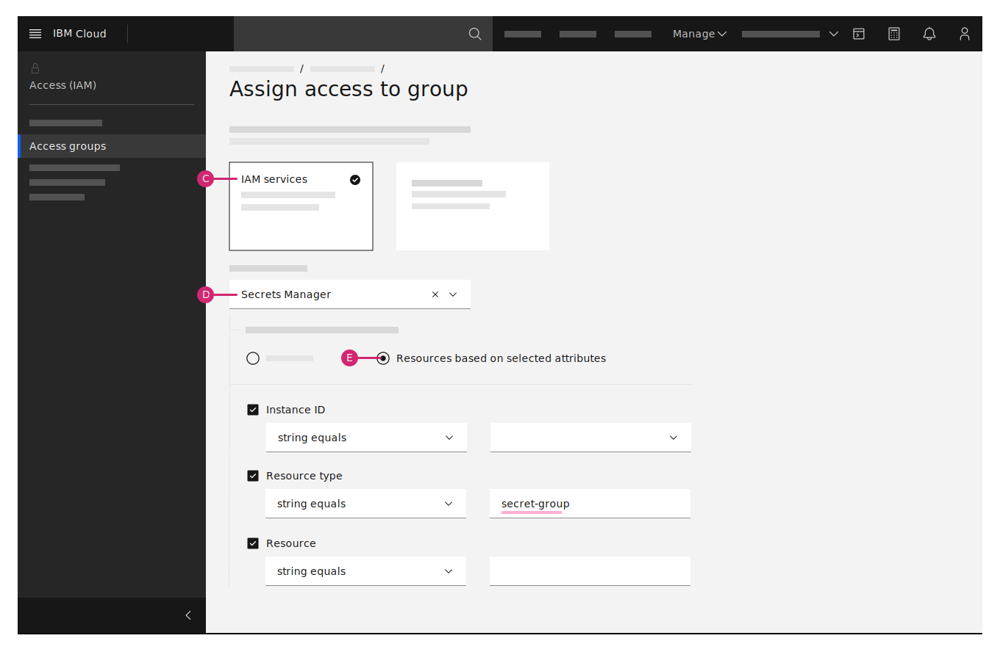

---

copyright:
  years: 2020, 2021
lastupdated: "2021-04-01"

keywords: assign access for Secrets Manager, secret group access, assign access for all secrets, grant access, add users

subcollection: secrets-manager

---

{:codeblock: .codeblock}
{:screen: .screen}
{:download: .download}
{:external: target="_blank" .external}
{:faq: data-hd-content-type='faq'}
{:gif: data-image-type='gif'}
{:important: .important}
{:note: .note}
{:pre: .pre}
{:tip: .tip}
{:preview: .preview}
{:deprecated: .deprecated}
{:beta: .beta}
{:term: .term}
{:shortdesc: .shortdesc}
{:script: data-hd-video='script'}
{:support: data-reuse='support'}
{:table: .aria-labeledby="caption"}
{:troubleshoot: data-hd-content-type='troubleshoot'}
{:help: data-hd-content-type='help'}
{:tsCauses: .tsCauses}
{:tsResolve: .tsResolve}
{:tsSymptoms: .tsSymptoms}
{:video: .video}
{:step: data-tutorial-type='step'}
{:tutorial: data-hd-content-type='tutorial'}
{:api: .ph data-hd-interface='api'}
{:cli: .ph data-hd-interface='cli'}
{:ui: .ph data-hd-interface='ui'}
{:curl: .ph data-hd-programlang='curl'}
{:java: .ph data-hd-programlang='java'}
{:ruby: .ph data-hd-programlang='ruby'}
{:c#: .ph data-hd-programlang='c#'}
{:objectc: .ph data-hd-programlang='Objective C'}
{:python: .ph data-hd-programlang='python'}
{:javascript: .ph data-hd-programlang='javascript'}
{:php: .ph data-hd-programlang='PHP'}
{:swift: .ph data-hd-programlang='swift'}
{:curl: .ph data-hd-programlang='curl'}
{:dotnet-standard: .ph data-hd-programlang='dotnet-standard'}
{:go: .ph data-hd-programlang='go'}
{:unity: .ph data-hd-programlang='unity'}

# Assigning access to {{site.data.keyword.secrets-manager_short}}
{: #assign-access}

You can enable different levels of access to {{site.data.keyword.secrets-manager_full}} resources in your {{site.data.keyword.cloud_notm}} account by creating and modifying {{site.data.keyword.cloud_notm}} IAM access policies.
{: shortdesc}

As an account owner, determine an access policy type for users, service IDs, and access groups based on your internal access control requirements. For example, if you want to grant user access to {{site.data.keyword.secrets-manager_short}} at the smallest scope available, you can [assign access to a secret group](#assign-access-secret-group) in an instance.

To learn more about suggested guidelines for assigning access to secrets, check out [Best practices for organizing secrets and assigning access](/docs/secrets-manager?topic=secrets-manager-best-practices-organize-secrets).
{: tip}

## Before you begin
{: #before-access}

Before you get started, be sure that you have [**Administrator** platform access](/docs/account?topic=account-assign-access-resources#assign-new-access) so that you can further assign roles and customize access policies for others.

## Assigning access to a {{site.data.keyword.secrets-manager_short}} instance
{: #assign-access-instance}

To assign access to a {{site.data.keyword.secrets-manager_short}} instance and its contained secrets or secret groups, you can use the **Access (IAM)** section of the console.

1. [Create an access group](/docs/account?topic=account-groups#create_ag) for the users and service IDs that you want to give access to and add those users to the group.

   For example, you might have a group of security admins that might need the same level of access.
2. After you create a group and add users, go to **Manage > Access (IAM) > Access Groups**.
3. Select a table row, and click the **Actions** menu  to open a list of options for that access group.
4. Click **Assign access**.
5. Select **IAM services**.
6. From the list of services, select **{{site.data.keyword.secrets-manager_short}}**.
7. From the list of options, select a region and a {{site.data.keyword.secrets-manager_short}} service instance.

    If you choose not to provide a specific instance, access is assigned for all instances of the service within the region that you selected. If you choose not to select a region, access is granted for all instances of the service in your account.
8. Choose a combination of [platform and service access roles](/docs/secrets-manager?topic=secrets-manager-iam) to assign access for access group.
9.  Click **Add**.
10. Review your selections and click **Assign**.

  Now you can add users and service IDs to the access group so that you can assign access to {{site.data.keyword.secrets-manager_short}} with a single access policy. For more information, see [Setting up access groups](/docs/account?topic=account-groups).

## Assigning access to a secret group
{: #assign-access-secret-group}

You can further narrow the scope of access to secrets in your instance by creating and managing [secret groups](#x9968962){: term}.

### Assigning access by using the {{site.data.keyword.secrets-manager_short}} UI
{: #assign-access-secret-group-using-secrets-manager}

[After you create a secret group for your instance](/docs/secrets-manager?topic=secrets-manager-secret-groups#create-secret-groups), you can use the **Secret groups** section of the {{site.data.keyword.secrets-manager_short}} UI to manage its access.

1. In the {{site.data.keyword.cloud_notm}} console, click the **Menu** icon  **> Resource List** to view a list of your resources.
2. Select your instance of {{site.data.keyword.secrets-manager_short}}.
3. In the navigation, click **Secret groups**.
4. Use the **Secret groups** table to browse the groups in your instance.
5. In the row of the group that you want to manage, click the **Actions** menu  **> Manage access**.
6. Select an access group to give its contained users and service IDs access to your secret group.
7. Choose a combination of [access roles](/docs/secrets-manager?topic=secrets-manager-iam) to assign.

    If you want to grant the users or service IDs in your access group the ability to view your {{site.data.keyword.secrets-manager_short}} service instance from the Resource list in the {{site.data.keyword.cloud_notm}} console, be sure to assign the [**Viewer** platform role](/docs/secrets-manager?topic=secrets-manager-iam#iam-roles-actions).
8. Click **Review**.
9.  Review your selections and click **Assign**.

### Assigning access by using the IAM UI
{: #assign-access-secret-group-using-iam}

You can also use the **Access (IAM)** section of the {{site.data.keyword.cloud_notm}} console to manage access for your secret groups. To assign access by using the IAM UI, you need to supply the ID of the secret group that you want to manage.

You can copy the ID of a secret group from the **Secret groups** table in your {{site.data.keyword.secrets-manager_short}} service instance.
{: tip}

{: caption="Figure 1. Assigning access to a secret group" caption-side="bottom"}

1. Go to **Manage > Access (IAM) > Access Groups**.
2. In the row for the access group that you want to manage, click the **Actions** menu  **> Assign access**.
3. Select **IAM services**.
4. From the list of services, select **{{site.data.keyword.secrets-manager_short}}**.
5. Select **Resources based on selected attributes**.
6. In the **Instance ID** field, select your {{site.data.keyword.secrets-manager_short}} instance.
7. In the **Resource Type** field, enter `secret-group`.
8. In the **Resource** field, enter the ID that was assigned to your secret group by the {{site.data.keyword.secrets-manager_short}} service.
9.  Choose a combination of [access roles](/docs/secrets-manager?topic=secrets-manager-iam) to assign.

    If you want to grant the users or service IDs in your access group the ability to view your {{site.data.keyword.secrets-manager_short}} service instance from the Resource list in the {{site.data.keyword.cloud_notm}} console, be sure to assign the [**Viewer** platform role](/docs/secrets-manager?topic=secrets-manager-iam#iam-roles-actions).
10. Click **Add**.
11. Review your selections and click **Assign**.