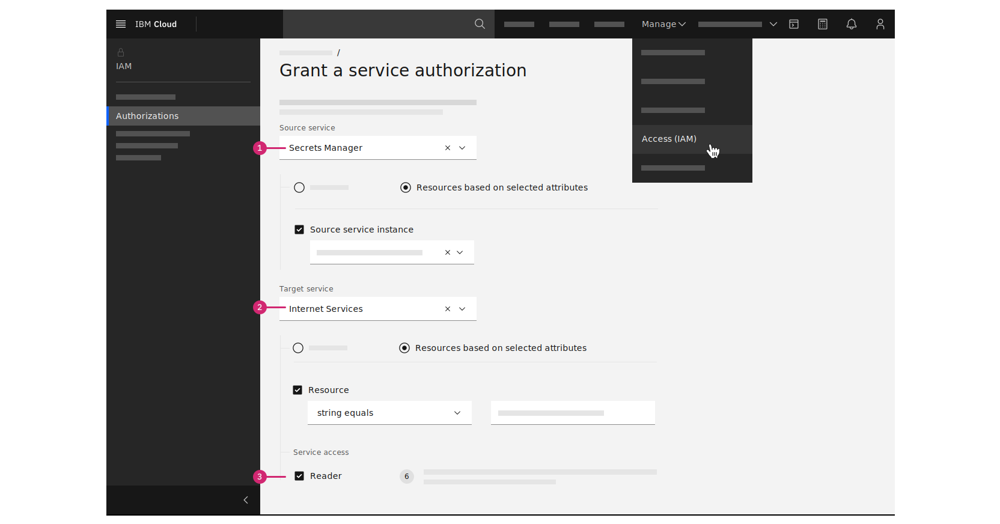
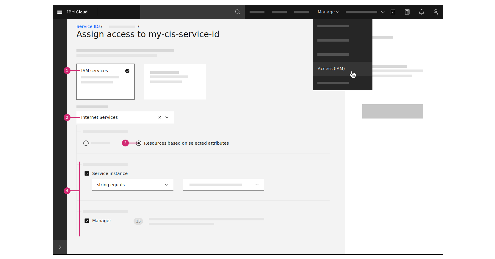
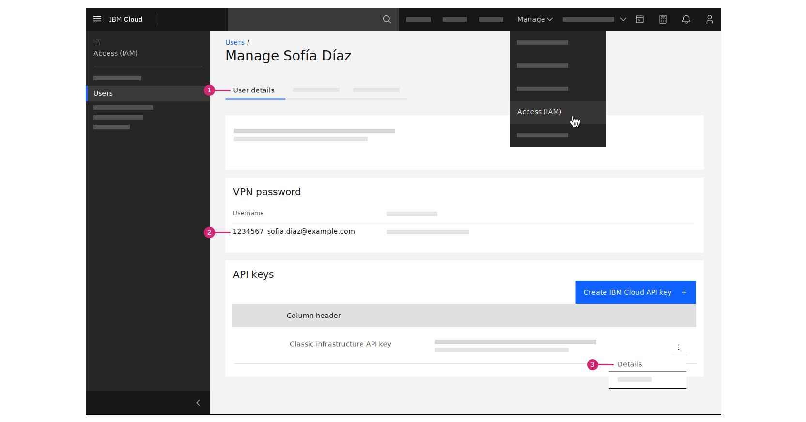

---

copyright:
  years: 2020, 2022
lastupdated: "2022-02-03"

keywords: set up certificates, set up public certificates, public certificates engine, set up CIS, set up CA, set up Let's Encrypt

subcollection: secrets-manager

---

{:codeblock: .codeblock}
{:screen: .screen}
{:download: .download}
{:external: target="_blank" .external}
{:faq: data-hd-content-type='faq'}
{:gif: data-image-type='gif'}
{:important: .important}
{:note: .note}
{:pre: .pre}
{:tip: .tip}
{:preview: .preview}
{:deprecated: .deprecated}
{:beta: .beta}
{:term: .term}
{:shortdesc: .shortdesc}
{:script: data-hd-video='script'}
{:support: data-reuse='support'}
{:table: .aria-labeledby="caption"}
{:troubleshoot: data-hd-content-type='troubleshoot'}
{:help: data-hd-content-type='help'}
{:tsCauses: .tsCauses}
{:tsResolve: .tsResolve}
{:tsSymptoms: .tsSymptoms}
{:video: .video}
{:step: data-tutorial-type='step'}
{:tutorial: data-hd-content-type='tutorial'}
{:api: .ph data-hd-interface='api'}
{:cli: .ph data-hd-interface='cli'}
{:ui: .ph data-hd-interface='ui'}
{:curl: .ph data-hd-programlang='curl'}
{:java: .ph data-hd-programlang='java'}
{:ruby: .ph data-hd-programlang='ruby'}
{:c#: .ph data-hd-programlang='c#'}
{:objectc: .ph data-hd-programlang='Objective C'}
{:python: .ph data-hd-programlang='python'}
{:javascript: .ph data-hd-programlang='javascript'}
{:php: .ph data-hd-programlang='PHP'}
{:swift: .ph data-hd-programlang='swift'}
{:curl: .ph data-hd-programlang='curl'}
{:dotnet-standard: .ph data-hd-programlang='dotnet-standard'}
{:go: .ph data-hd-programlang='go'}
{:unity: .ph data-hd-programlang='unity'}
{:release-note: data-hd-content-type='release-note'}

# Preparing to order certificates
{: #prepare-order-certificates}

You can enable your {{site.data.keyword.secrets-manager_full}} service instance to order certificates by configuring the public certificates engine.
{: shortdesc}

In {{site.data.keyword.secrets-manager_short}}, the public certificates engine serves as the back end for the `public_cert` secret type. Public certificates are domain-validated TLS certificates that you can order and manage in the service. Before you can order a certificate, you must enable your service instance by connecting supported certificate authorities (CA) and DNS providers.

[Ordering a certificate](/docs/secrets-manager?topic=secrets-manager-certificates#order-certificates) through {{site.data.keyword.secrets-manager_short}} is an asynchronous process that can take a few minutes to complete.
{: note}


## Supported certificate authorities
{: #connect-certificate-authority}

A certificate authority (CA) is an entity that issues digital certificates. You can connect the following certificate authorities with your {{site.data.keyword.secrets-manager_short}} service instance.

| Authority | Description |
| --------- | ----------- | 
| [Let's Encrypt](https://letsencrypt.org/){: external} | Let’s Encrypt is a free, automated, ACME-based certificate authority that provides domain validated certificates valid for 90 days. It is a service that is provided by the Internet Security Research Group (ISRG). |
{: caption="Table 1. Certificate authority options" caption-side="top"}


### Creating a Let's Encrypt ACME account
{: #create-acme-account}

To connect with Let's Encrypt, {{site.data.keyword.secrets-manager_short}} uses the [Automatic Certificate Management Environment (ACME)](https://datatracker.ietf.org/doc/html/rfc8555){: external} protocol. The ACME protocol makes it possible to automatically obtain browser trusted certificates from a certificate authority without human intervention.

You can grant service access to Let's Encrypt by registering an ACME account and providing your account credentials. If you have an working ACME client or account for Let's Encrypt, you can use your existing private key. If you don't have an account yet, you can create one by using the [ACME account creation tool](https://github.com/ibm-cloud-security/acme-account-creation-tool){: external}.

Certificate authorities may apply a charge when ordering or renewing a certificate. Additionally, various rate limits apply. {{site.data.keyword.secrets-manager_short}} does not control costs or rate limits that are associated with ordering certificates. For more information about rate limits to keep in mind as you order Let's Encrypt certificates, check out the [Let's Encrypt documentation](https://letsencrypt.org/docs/rate-limits/){: external}.
{: note} 


## Supported DNS providers
{: #connect-dns-provider}

A DNS provider is the service that is used to manage the domains that you own. You can connect the following DNS providers with your {{site.data.keyword.secrets-manager_short}} service instance.

| DNS provider | Description |
| --------- | ----------- | 
| [{{site.data.keyword.cis_full_notm}}](https://{DomainName}/catalog/services/internet-services) | {{site.data.keyword.cis_full}} (CIS), powered by Cloudflare, provides a fast, highly performant, reliable, and secure internet service for customers running their business on {{site.data.keyword.cloud_notm}}. |
| [{{site.data.keyword.cloud_notm}} classic infrastructure](https://{DomainName}/catalog/infrastructure/domain_registration)  | {{site.data.keyword.cloud}} Domain Name Registration, available as part of {{site.data.keyword.cloud_notm}} classic infrastructure (SoftLayer), offers a central location from which to view and manage domains. |
{: caption="Table 2. DNS provider options" caption-side="top"}

### Granting service access to CIS
{: #authorize-cis}

If you manage your domains in {{site.data.keyword.cis_short}}, you must assign access to {{site.data.keyword.secrets-manager_short}} so that it can validate the ownership. To authorize {{site.data.keyword.secrets-manager_short}} to view a {{site.data.keyword.cis_short_notm}} instance and its domains, you can [create an authorization between the services](/docs/account?topic=account-serviceauth) if your instances are located in the same account.

If you're working with a CIS instance that is located in another account, you can use an API key to manage access. For more information, see [Granting service access by using an API key](/docs/secrets-manager?topic=secrets-manager-prepare-order-certificates#authorize-cis-another-account).
{: note}

#### Granting service access to all domains
{: #authorize-all-domains}

You can grant {{site.data.keyword.secrets-manager_short}} the ability to access your CIS instance and all of its domains by creating a service authorization between the services. Both your {{site.data.keyword.secrets-manager_short}} and CIS instance must be in the same account.

To create a service authorization, you can use the **Access (IAM)** section of the console.

{: caption="Figure 1. Creating a service authorization between Secrets Manager and CIS" caption-side="bottom"}

1. In the console, click **Manage > Access (IAM)**, and select **Authorizations**.
2. Click **Create**.
3. Select a source and target service for the authorization.
   
    1. From the **Source service** list, select {{site.data.keyword.secrets-manager_short}}.
    2. From the **Target service** list, select Internet Services.
4. Specify a service instance for both the source and the target.
5. Select the **Reader** role. With these permissions, your {{site.data.keyword.secrets-manager_short}} instance can view the {{site.data.keyword.cis_short_notm}} instance and its domains.
   
   For testing purposes, you can assign the **Manager** service access role to manage all of your domains. For production environments, it is recommended that you assign the **Reader** service access role and use the [IAM Policy Management API](#authorize-specific-domains) to grant the **Manager** role only to specific domains.
   {: note}

6. Click **Authorize**.
7. Complete the steps to [add a certificate authority configuration](/docs/secrets-manager?topic=secrets-manager-add-certificate-authority) to your {{site.data.keyword.secrets-manager_short}} instance. 

#### Granting service access to specific domains
{: #authorize-specific-domains}

To grant access to specific domains, you can use the [IAM Policy Management API](/apidocs/iam-policy-management#create-a-policy) to assign the **Manager** service role. With **Manager** access, {{site.data.keyword.secrets-manager_short}} can manage the DNS records for the individual domains that exist in your {{site.data.keyword.cis_short_notm}} instance.

The following example shows a query that you can use to assign access between {{site.data.keyword.secrets-manager_short}} and your selected domains.

```sh
curl -X POST https://iam.cloud.ibm.com/v1/policies \
-H 'Accept: application/json' \
-H 'Content-Type: application/json' \
-H 'Authorization: Bearer <IAM_token>' \
-d '{ 
    "type": "authorization", 
    "subjects": [ 
        { 
            "attributes": [ 
                { 
                    "name": "serviceName", 
                    "value": "secrets-manager" 
                },
                {
                    "name": "accountId", 
                    "value": "<account_id>" 
                }, 
                { 
                    "name": "serviceInstance", 
                    "value": "<secrets_manager_instance_id>" 
                } 
            ] 
        } 
    ], 
    "roles": [
        { 
            "role_id": "crn:v1:bluemix:public:iam::::serviceRole:Manager" 
        }
    ], 
    "resources": [ 
        { 
            "attributes": [ 
                { 
                    "name": "serviceName", 
                    "value": "internet-svcs" 
                }, 
                { 
                    "name": "accountId",
                    "value": "<account_id>"
                }, 
                {
                    "name": "serviceInstance",
                    "value": "<cis_instance_id>"
                }, 
                {
                    "name": "domainId", 
                    "value": "<domain_id>" 
                },
                { 
                    "name": "cfgType", 
                    "value": "reliability" 
                }, 
                { 
                    "name": "subScope", 
                    "value": "dnsRecord" 
                } 
            ] 
        }
    ]
}'
```
{: codeblock}

| Variable | Descriptions |
| -------- | ------------ |
| `IAM_token` | A valid IAM token. You can find the value by using the {{site.data.keyword.cloud_notm}} CLI: `ibmcloud iam oauth-tokens`. |
| `account_id` | The ID for the account where the {{site.data.keyword.secrets-manager_short}} and {{site.data.keyword.cis_short_notm}} instances exist. You can find the value by navigating to **{{site.data.keyword.cloud_notm}} > Manage > Account > Account Settings** or by using the {{site.data.keyword.cloud_notm}} CLI: `ibmcloud account show`. |
| `secrets_manager_instance_id` | The ID of your {{site.data.keyword.secrets-manager_short}} instance. To find the value, use the {{site.data.keyword.cloud_notm}} CLI: `ibmcloud resource service-instance "Instance name"`. |
| `cis_instance_id` | The ID of your {{site.data.keyword.cis_short_notm}} instance. To find the value, use the {{site.data.keyword.cloud_notm}} CLI: `ibmcloud resource service-instance "Instance name"`. |
| `domain_id` | The ID of your domain as it is found in {{site.data.keyword.cis_short_notm}}. To find the value, use the {{site.data.keyword.cloud_notm}} CLI to run `ibmcloud cis domains`. To manage multiple domains, modify the `resources` array. |
{: caption="Table 3. Parameter descriptions" caption-side="top"}

#### Granting service access by using an API key
{: #authorize-cis-another-account}

If the CIS instance that you'd like to access is located in another account, you can create an authorization between the services by providing an API key. You need the Cloud Resource Name (CRN) of the CIS instance that contains your domains, and an API key with the correct level of access to your instance. The API key must grant {{site.data.keyword.secrets-manager_short}} the ability to view the CIS instance, access its domains, and manage TXT records.

To assign access, you can use the **Access (IAM)** section of the console.

{: caption="Figure 2. Assigning CIS access to service ID" caption-side="bottom"}

1. Log in to the account in which your CIS instance is located.
2. Click **Manage > Access (IAM)**, and select **Service IDs**.
3. [Create a service ID API key](/docs/account?topic=account-serviceidapikeys) or select an existing one.
4. Assign the required access to view the CIS instance, access its domains, and manage TXT records.
   
   1. In the row of the service ID, click the **Actions** icon  **> Assign access**.
   2. Click the **IAM services** tile.
   3. From the list of services, select **Internet Services**.
   4. Select **Resources based on selected attributes**.
   5. In the **Service instance** field, select your CIS instance.
   6. In the Service access section, select the **Manager** role. If you want to grant the service ID the ability to access the CIS instance from the Resource list in the {{site.data.keyword.cloud_notm}} console, you can also assign the **Viewer** platform role. 
5.  Complete the steps to [add a DNS configuration](/docs/secrets-manager?topic=secrets-manager-add-dns-provider) to your {{site.data.keyword.secrets-manager_short}} instance. 


### Granting service access to classic infrastructure
{: #authorize-classic-infrastructure}

If you manage domains by using classic infrastructure, you must grant service access to its DNS service so that {{site.data.keyword.secrets-manager_short}} can validate the ownership of your domains. You'll need your classic infrastructure account credentials before you can grant access.

To obtain your classic infrastructure username and API key, you can use the **Access (IAM)** section of the console.

{: caption="Figure 3. Viewing your classic infrastructure username and API key" caption-side="bottom"}

1. In the console, go to **Manage > Access (IAM) > Users**, then select the user's name.
2. In the VPN password section, copy the **Username** value.
   
   In most cases, your classic infrastructure username is your `<account_id>_<email_address>`. This username is also your VPN username for the account.
3. In the API keys section, [create a classic infrastructure API key](/docs/account?topic=account-classic_keys) or find your existing key.
4. Click the **Actions** icon  **> Details** to copy the API key value.
5. Assign your user permissions to manage DNS in the account.
   
   For more information about managing classic infrastructure access, see [Classic infrastructure permissions](/docs/account?topic=account-infrapermission).

   1. Click the **Classic infrastructure** tab to manage your classic infrastructure permissions.
   2. In the Services section, ensure that the **Manage DNS** permission is selected.
6. Complete the steps to [add a DNS configuration](/docs/secrets-manager?topic=secrets-manager-add-dns-provider) to your {{site.data.keyword.secrets-manager_short}} instance.


## Next steps
{: #prepare-order-certificates-next-steps}

Now you're ready to add engine configurations to your instance.

- [Add a certificate authority configuration](/docs/secrets-manager?topic=secrets-manager-add-certificate-authority)
- [Add a DNS provider configuration](/docs/secrets-manager?topic=secrets-manager-add-dns-provider)

