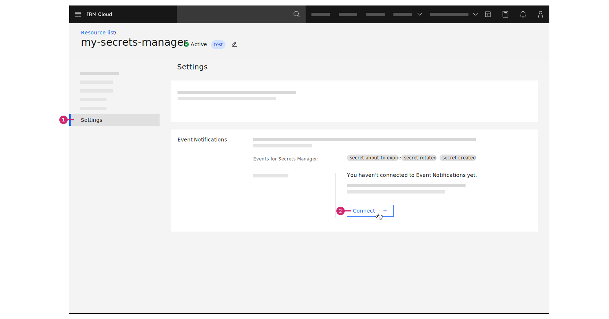

---

copyright:
  years: 2020, 2023
lastupdated: "2023-04-18"

keywords: event notifications for {{site.data.keyword.secrets-manager_short}}, event notifications integration for {{site.data.keyword.secrets-manager_short}}, alerts for {{site.data.keyword.secrets-manager_short}}

subcollection: secrets-manager

---

{:codeblock: .codeblock}
{:screen: .screen}
{:download: .download}
{:external: target="_blank" .external}
{:faq: data-hd-content-type='faq'}
{:gif: data-image-type='gif'}
{:important: .important}
{:note: .note}
{:pre: .pre}
{:tip: .tip}
{:preview: .preview}
{:deprecated: .deprecated}
{:beta: .beta}
{:term: .term}
{:shortdesc: .shortdesc}
{:script: data-hd-video='script'}
{:support: data-reuse='support'}
{:table: .aria-labeledby="caption"}
{:troubleshoot: data-hd-content-type='troubleshoot'}
{:help: data-hd-content-type='help'}
{:tsCauses: .tsCauses}
{:tsResolve: .tsResolve}
{:tsSymptoms: .tsSymptoms}
{:video: .video}
{:step: data-tutorial-type='step'}
{:tutorial: data-hd-content-type='tutorial'}
{:api: .ph data-hd-interface='api'}
{:cli: .ph data-hd-interface='cli'}
{:ui: .ph data-hd-interface='ui'}
{:terraform: .ph data-hd-interface="terraform"}
{:curl: .ph data-hd-programlang='curl'}
{:java: .ph data-hd-programlang='java'}
{:ruby: .ph data-hd-programlang='ruby'}
{:c#: .ph data-hd-programlang='c#'}
{:objectc: .ph data-hd-programlang='Objective C'}
{:python: .ph data-hd-programlang='python'}
{:javascript: .ph data-hd-programlang='javascript'}
{:php: .ph data-hd-programlang='PHP'}
{:swift: .ph data-hd-programlang='swift'}
{:curl: .ph data-hd-programlang='curl'}
{:dotnet-standard: .ph data-hd-programlang='dotnet-standard'}
{:go: .ph data-hd-programlang='go'}
{:unity: .ph data-hd-programlang='unity'}
{:release-note: data-hd-content-type='release-note'}

# Enabling event notifications for {{site.data.keyword.secrets-manager_short}}
{: #event-notifications}

As an administrator of {{site.data.keyword.secrets-manager_full}}, you might want to send notifications of events in {{site.data.keyword.secrets-manager_short}} to other users, or human destinations, by using email, SMS, or other supported delivery channels. Additionally, you might want to send these notifications of events to other applications to build logic by using event-driven programming using webhooks, for example. This is made possible by the integration between {{site.data.keyword.secrets-manager_short}} and {{site.data.keyword.en_full}}.
{: shortdesc}

To send information to {{site.data.keyword.en_short}}, you must connect your {{site.data.keyword.secrets-manager_short}} service instance to {{site.data.keyword.en_short}}. For more information about working with {{site.data.keyword.en_short}}, see [Getting started with {{site.data.keyword.en_short}}](/docs/event-notifications).


## How events are collected and sent by {{site.data.keyword.secrets-manager_short}}
{: #event-notifications-how}

When an event of interest takes place in your {{site.data.keyword.secrets-manager_short}} instance, {{site.data.keyword.secrets-manager_short}} communicates with a connected {{site.data.keyword.en_short}} instance to forward a notification to a [supported destination](/docs/event-notifications?topic=event-notifications-en-destination).

{{site.data.keyword.secrets-manager_short}} aggregates a list of your pending notifications by [event type](#event-notifications-list), the type of secret, and expiry details if they apply. Every 1 - 2 minutes, the service checks for and dispatches any pending notifications to the connected {{site.data.keyword.en_short}} service. For example, you might receive notifications that are similar to the following messages:

- You have 1 arbitrary secret that expires in 1 day.
- You have 5 public certificate secrets that expire in 10 days.
- You have 100 imported certificate secrets that expire in 30 days.

100 is the maximum number of secrets that you can be notified of in a single event notification.
{: note}

## Events for {{site.data.keyword.secrets-manager_short}}
{: #event-notifications-list}

The following table lists the {{site.data.keyword.secrets-manager_short}} actions that generate an event.

Depending on the type of secret that you're working with in the service, an event might not be generated by {{site.data.keyword.secrets-manager_short}}. For example, you don't receive a notification if a certificate is set to expire in less than 24 hours. For more information, refer to [Events by secret type](#event-notifications-by-secret-type).
{: note}

| Event name | Event type                           | Subtype        | Description | Severity level | 
| ---------- | ------------------------------------ | -------------- | ----------- | -------------- |
| Secret created | `com.ibm.cloud.secrets-manager.secret_created` | | An event is sent when a secret is added to the instance. | Low |
| Secret creation failed | `com.ibm.cloud.secrets-manager.secret_creation_failed` |  | An event is sent when a request to create a secret fails. | Low |
| Secret rotated | `com.ibm.cloud.secrets-manager.secret_rotated` |  | An event is sent when a secret is rotated and a new version becomes available. | Low |
| Secret rotation failed | `com.ibm.cloud.secrets-manager.secret_rotation_failed` | | An event is sent when a request to rotate a secret fails. | High |
| Secret expires in 90 days | `com.ibm.cloud.secrets-manager.secret_about_to_expire` | `in_90_days`   | An event is sent when a secret is 90 days from expiration. | High | 
| Secret expires in 60 days | `com.ibm.cloud.secrets-manager.secret_about_to_expire` | `in_60_days`   | An event is sent when a secret is 60 days from expiration. | High | 
| Secret expires in 30 days | `com.ibm.cloud.secrets-manager.secret_about_to_expire` | `in_30_days`   | An event is sent when a secret is 30 days from expiration. | High | 
| Secret expires in 10 days | `com.ibm.cloud.secrets-manager.secret_about_to_expire` | `in_10_days`   | An event is sent when a secret is 10 days from expiration. | High | 
| Secret expires in 1 day | `com.ibm.cloud.secrets-manager.secret_about_to_expire`   | `in_1_days`    | An event is sent when a secret is 1 day from expiration. | High | 
| Secret expires in less than 1 day | `com.ibm.cloud.secrets-manager.secret_about_to_expire` | `in_0_days` | An event is sent when a secret is less than 1 day from expiration. | High | 
| Secret expired | `com.ibm.cloud.secrets-manager.secret_expired` | | An event is sent when a secret reaches its expiration date and time. | High | 
| Secret revoked | `com.ibm.cloud.secrets-manager.secret_revoked` | | An event is sent when a version of a secret is revoked before it is scheduled to expire. | Low |
| Secret deleted | `com.ibm.cloud.secrets-manager.secret_deleted` |  | An event is sent when a secret is deleted from a {{site.data.keyword.secrets-manager_short}} instance. | Low |
| Secret deletion blocked | `com.ibm.cloud.secrets-manager.secret_deletion_blocked` | | An event is sent when a secret is unable to be deleted because it is locked. | Low |
| Secret revocation blocked | `com.ibm.cloud.secrets-manager.secret_revocation_blocked` | | An event is sent when a secret is unable to be revoked because it is locked. | Low |
| Secret rotation blocked | `com.ibm.cloud.secrets-manager.secret_rotation_blocked` | | An event is sent when a secret is unable to be rotated because it is locked. | Low |
| Secret expiration blocked | `com.ibm.cloud.secrets-manager.secret_expiration_blocked` | | An event is sent when a secret is unable to expire because it is locked. | High |
| Secret version data deleted | `com.ibm.cloud.secrets-manager.secret_version_data_deleted` | | An event is sent when a secret version's data is deleted. | Low |
| Test event | `com.ibm.cloud.secrets-manager.test_event` | | An event is sent when a test notification is forwarded to {{site.data.keyword.en_short}}. | Low |
{: caption="Table 1. Actions that generate event notifications" caption-side="bottom"}


### Supported secret types
{: #event-notifications-by-secret-type}

The following table lists the {{site.data.keyword.secrets-manager_short}} events that can be generated based on secret types that are supported in the service.


| Event name | Event type | Occurrence | Arbitrary | IAM credentials | Key-value | User credentials | Imported certificates | Private certificates | Public certificates |
| --- | --- | --- | --- | --- | --- | --- | --- | --- | --- |
| Secret created | `com.ibm.cloud.secrets-manager.secret_created` | One time | | | | | | | |
| Secret creation failed | `com.ibm.cloud.secrets-manager.secret_creation_failed` | One time | | | | | | | |
| Secret rotated | `com.ibm.cloud.secrets-manager.secret_rotated` | One time | | | | |  |  | |
| Secret rotation failed | `com.ibm.cloud.secrets-manager.secret_rotation_failed` | One time | | | | | | |  |
| Secret about to expire | `com.ibm.cloud.secrets-manager.secret_about_to_expire` | 90, 60, 30, 10, 1, 0 days before the secret expires |  |  | Not applicable[^na-1] |  |  |  |  |
| Secret expired | `com.ibm.cloud.secrets-manager.secret_expired` | Daily |  |  | Not applicable[^na-2]|  |  |  |  |
| Secret revoked | `com.ibm.cloud.secrets-manager.secret_revoked` | One time | | | | |  |  | |
| Secret deleted | `com.ibm.cloud.secrets-manager.secret_deleted` | One time | | | | |   |  |  |
| Secret deletion blocked | `com.ibm.cloud.secrets-manager.secret_deletion_blocked` | One time | | | | | | | |
| Secret rotation blocked | `com.ibm.cloud.secrets-manager.secret_rotation_blocked` | One time[^man]  \n Daily[^auto] | | | | | | | |
| Secret revocation blocked | `com.ibm.cloud.secrets-manager.secret_revocation_blocked` | One time | Not applicable[^na-4] | Not applicable[^na-5] | Not applicable[^na-6] | Not applicable[^na-7] | Not applicable[^na-8] | | Not applicable[^na-9] |
| Secret expiration blocked | `com.ibm.cloud.secrets-manager.secret_expiration_blocked` | One time  \n Daily | |  | Not applicable[^na-3]|  | | | |
| Secret version data deleted | `com.ibm.cloud.secrets-manager.secret_version_data_deleted` | One time | | | | | | | |
{: caption="Table 2. Actions that generate events based on secret type" caption-side="bottom"}

[^na-1]: Event is not applicable because there isn't a time-to-live (TTL) limit for this secret type.
[^na-2]: Event is not applicable because there isn't a time-to-live (TTL) limit for this secret type.
[^na-3]: Event is not applicable because there isn't a time-to-live (TTL) limit for this secret type.
[^na-4]: Event is not applicable because this notification type applies to private certificates only.
[^na-5]: Event is not applicable because this notification type applies to private certificates only.
[^na-6]: Event is not applicable because this notification type applies to private certificates only.
[^na-7]: Event is not applicable because this notification type applies to private certificates only.
[^na-8]: Event is not applicable because this notification type applies to private certificates only.
[^na-9]: Event is not applicable because this notification type applies to private certificates only.
[^man]: You receive a notification that informs you that your manual rotation was not successful.
[^auto]: When an automatic rotation fails, you are notified daily until it is successful.


## Enabling notifications
{: #event-notifications-enable}

Events that are generated by an instance of the {{site.data.keyword.secrets-manager_short}} service can be forwarded to an {{site.data.keyword.en_short}} service instance that is available in the same account. You can configure only one {{site.data.keyword.secrets-manager_short}} instance to one {{site.data.keyword.en_short}} service instance. To get started, you need:

- [**Manager** service access](/docs/secrets-manager?topic=secrets-manager-iam) on the {{site.data.keyword.secrets-manager_short}} service.
- [**Manager** service access](/docs/event-notifications?topic=event-notifications-service-access-management) on the {{site.data.keyword.en_short}} service. To view an existing {{site.data.keyword.en_short}} service instance in your account, you also need **Viewer** platform access or higher.


### Connecting to {{site.data.keyword.en_short}} in the UI
{: #event-notifications-enable-ui}
{: ui}

Before you can enable notifications for {{site.data.keyword.secrets-manager_short}}, be sure that you have an [{{site.data.keyword.en_short}} service instance](/catalog/services/event-notifications){: external} that is in the same account as your {{site.data.keyword.secrets-manager_short}} instance. Then, you can use the **Settings > Event Notifications** section in the {{site.data.keyword.secrets-manager_short}} UI to connect the services.

{: caption="Figure 1. Connecting to {{site.data.keyword.en_short}}" caption-side="bottom"}

1. In the console, click the **Menu** icon  **> Resource list**.
2. From the list of services, select your instance of {{site.data.keyword.secrets-manager_short}}.
3. In the {{site.data.keyword.secrets-manager_short}} navigation, click **Settings**.
4. In the {{site.data.keyword.en_short}} section, and click **Connect**.
5. In the side panel, review the source details for the connection. Optionally, provide a description.
6. Select the resource group and {{site.data.keyword.en_short}} service instance that you want to connect.

    If an IAM authorization between {{site.data.keyword.secrets-manager_short}} and {{site.data.keyword.en_short}} doesn't exist in your account, a dialog is displayed. Follow the prompts to grant access between the services.

    1. To grant access between {{site.data.keyword.secrets-manager_short}} and {{site.data.keyword.en_short}}, click **Authorize**.
    2. In the side panel, select **{{site.data.keyword.en_short}}** as the target service.
    3. From the list of instances, select the {{site.data.keyword.en_short}} service instance that you want to authorize.
    4. Select the **Event Source Manager** role.
    5. Click **Review**.
    6. Click **Assign**.

7. To confirm the connection, click **Connect**.

   A success message is displayed to indicate that {{site.data.keyword.secrets-manager_short}} is now connected to {{site.data.keyword.en_short}}. If you need to disconnect from {{site.data.keyword.en_short}} later, you can use the options menu  **> Disconnect** to remove the {{site.data.keyword.secrets-manager_short}} as a source service in the {{site.data.keyword.en_short}} instance.

   If you choose to disconnect {{site.data.keyword.en_short}}, do not delete the IAM authorization between {{site.data.keyword.secrets-manager_short}} and {{site.data.keyword.en_short}}. {{site.data.keyword.secrets-manager_short}} uses the existing authorization to unregister from {{site.data.keyword.en_short}}. If an {{site.data.keyword.en_short}} instance is deleted, any authorizations that exist between the service and the {{site.data.keyword.secrets-manager_short}} are also deleted by IAM.
   {: important}

### Connecting to {{site.data.keyword.en_short}} with the API
{: #event-notifications-enable-api}
{: api}

Before you can enable notifications for {{site.data.keyword.secrets-manager_short}}, be sure that you have an [{{site.data.keyword.en_short}} service instance](/catalog/services/event-notifications){: external} that is in the same account as your {{site.data.keyword.secrets-manager_short}} instance. Then, you can connect to {{site.data.keyword.en_short}} programmatically by calling the {{site.data.keyword.secrets-manager_short}} API.

The following example shows a query that you can use to register your {{site.data.keyword.secrets-manager_short}} source details with {{site.data.keyword.en_short}}. When you call the API, replace the ID variables and IAM token with the values that are specific to your {{site.data.keyword.secrets-manager_short}} instance.
{: curl}

You can find the `event_notifications_instance_crn` value in the console by going to the Resource list and clicking the {{site.data.keyword.en_short}} instance row.
{: tip}


```sh
curl -X POST 
   --H "Authorization: Bearer {iam_token}" \
   --H "Accept: application/json" \
   --H "Content-Type: application/json" \
   --d'{
      "event_notifications_instance_crn": "crn:v1:bluemix:public:event-notifications:us-south:a/22018f3c34ff4ff193698d15ca316946:578ad1a4-2fd8-4e66-95d5-79a842ba91f8::",
      "event_notifications_source_description": "Optional description of this source in an Event Notifications instance.",
      "event_notifications_source_name": "My Secrets Manager"
   }' \
"https://{instance_ID}.{region}.secrets-manager.appdomain.cloud/api/v2/notifications/registration"
```
{: codeblock}
{: curl}


A successful request returns the CRN value of your connected {{site.data.keyword.en_short}} service instance. For more information about the required and optional request parameters, see the [API docs](/apidocs/secrets-manager).


### Connecting to {{site.data.keyword.en_short}} with Terraform
{: #event-notifications-enable-terraform}
{: terraform}

The following example shows a configuration that you can use to to register your {{site.data.keyword.secrets-manager_short}} source details with {{site.data.keyword.en_short}}.

```terraform
    resource "ibm_sm_en_registration" "en_registration" {
        instance_id = local.instance_id
        region = local.region
        name = "test-root-ca"
        event_notifications_instance_crn = var.en_instance_crn
        event_notifications_source_description = "My event notification source"
        event_notifications_source_name = "my_en_source"
    }
```
{: codeblock}


### Sending a test event to {{site.data.keyword.en_short}} in the UI
{: #event-notifications-test-ui}
{: ui}

After you enable notifications for {{site.data.keyword.secrets-manager_short}}, test your connection to ensure that the events that are generated by {{site.data.keyword.secrets-manager_short}} are being forwarded to {{site.data.keyword.en_short}}.

Before you can send a test {{site.data.keyword.secrets-manager_short}} events, you must have [topics, destinations, and subscriptions](/docs/event-notifications?topic=event-notifications-en-create-en-topic) created in your {{site.data.keyword.en_short}} instance. Be sure that the **Test event** event type (`com.ibm.cloud.secrets-manager.test_event`) is included as a condition in your {{site.data.keyword.en_short}} topic.
{: note}

{: caption="Figure 2. Sending a test event to {{site.data.keyword.en_short}}" caption-side="bottom"}

1. In the {{site.data.keyword.secrets-manager_short}} UI, click **Settings**.
2. In the Event Notifications section, click **Send test event**.

   A success message is displayed to indicate that the test event was forwarded successfully to {{site.data.keyword.en_short}}.

### Sending a test event to {{site.data.keyword.en_short}} with the API
{: #event-notifications-test-api}
{: api}

After you enable notifications for {{site.data.keyword.secrets-manager_short}}, test your connection to ensure that the events that are generated by {{site.data.keyword.secrets-manager_short}} are being forwarded to {{site.data.keyword.en_short}}.

Before you can send a test {{site.data.keyword.secrets-manager_short}} event, you must have [topics, destinations, and subscriptions](/docs/event-notifications?topic=event-notifications-en-create-en-topic) created in your {{site.data.keyword.en_short}} instance. Be sure that the **Test event** event type (`com.ibm.cloud.secrets-manager.test_event`) is included as a condition in your {{site.data.keyword.en_short}} topic.
{: note}

The following example shows a query that you can use to send a test event from the {{site.data.keyword.secrets-manager_short}} to {{site.data.keyword.en_short}}. When you call the API, replace the ID variables and IAM token with the values that are specific to your {{site.data.keyword.secrets-manager_short}} instance.
{: curl}


```sh
curl -X GET 
   --H "Authorization: Bearer {iam_token}" \
   "https://{instance_ID}.{region}.secrets-manager.appdomain.cloud/api/v2/notifications/registration/test"
```
{: codeblock}
{: curl}

A successful request returns an HTTP `200 OK` response to indicate that a test event was forwarded successfully to your connected {{site.data.keyword.en_short}} service instance. For more information, see the [API docs](/apidocs/secrets-manager).


## Delivering notifications to select destinations
{: #event-notifications-destinations}

After you enable notifications for {{site.data.keyword.secrets-manager_short}}, create topics and subscriptions in {{site.data.keyword.en_short}} so that alerts can be forwarded and delivered to your selected destinations. 

For a complete list of supported destinations, see the [{{site.data.keyword.en_short}} documentation](/docs/event-notifications?topic=event-notifications-en-destination).
{: tip}

### Email notifications
{: #event-notifications-email}

You can use the [{{site.data.keyword.cloud_notm}} email service](/docs/event-notifications?topic=event-notifications-en-destinations-email) as a delivery channel for {{site.data.keyword.secrets-manager_short}} event notifications. [Create an {{site.data.keyword.en_short}} subscription](/docs/event-notifications?topic=event-notifications-en-create-en-subscription) between an existing topic and the {{site.data.keyword.cloud_notm}} email service to forward your alerts to various recipients by email. 

An email from {{site.data.keyword.cloud_notm}} that contains information about a {{site.data.keyword.secrets-manager_short}} event resembles the following example:

```plaintext
Subject: Your 2 public certificate secrets expire in 10 days
Body: You have 2 public certificate secrets that expire in 10 days: my-certificate-1, my-certificate-2. You can view and manage your existing secrets by accessing Secrets Manager in the console, or by using the CLI or APIs. For more information, check out the docs.
```
{: screen}

To receive detailed information about an event notification in your email, select the **Add notification payload** option when you create an {{site.data.keyword.en_short}} subscription. Your email displays the [notification payload details](#event-notifications-payload) that are associated with the event. 
{: tip}


### Webhooks
{: #event-notifications-webhook}

You can configure a webhook destination so that an incoming notification can be consumed programmatically by an app or service. For more information about setting up webhooks, check out the [{{site.data.keyword.en_short}} documentation](/docs/event-notifications?topic=event-notifications-en-destinations-webhook).
 
## Notification payload details
{: #event-notifications-payload}

Successful events that are generated by {{site.data.keyword.secrets-manager_short}} contain various fields that help you to identify the source and details of an event. 

Event notifications from {{site.data.keyword.secrets-manager_short}} contain only metadata properties, such as names or identifiers of resources. Sensitive data, for example API keys or passwords, are not included in generated events.
{: note}

The properties that are sent to {{site.data.keyword.en_short}} vary depending on the event type and type of secret. For example, if an `secret_about_to_expire:in_10_days` event takes place in an instance for one or more `public_cert` secrets, {{site.data.keyword.secrets-manager_short}} sends a notification payload to {{site.data.keyword.en_short}} that is similar to the following example.

```json
{
   "event_sub_type": "in_10_days",
   "event_type": "secret_about_to_expire",
   "secret_type": "public_cert",
   "secrets": [
      {
         "domains": "domain1.com",
         "event_time": "2022-01-04T00:00:00Z",
         "event_triggered_by": "SecretsManager",
         "secret_expiration": "2022-01-14T00:00:00Z",
         "secret_group_id": "default",
         "secret_id": "crn:v1:bluemix:public:secrets-manager:<region>:a/<account_id>:<instance_id>:secret:<secret_id>",
         "secret_name": "my-certificate-1",
         "serial_number": "1:2:3:4"
      },
      {
         "domains": "domain2.com, domain3.com",
         "event_time": "2022-01-04T00:00:00Z",
         "event_triggered_by": "SecretsManager",
         "secret_expiration": "2022-01-14T00:00:00Z",
         "secret_group_id": "default",
         "secret_id": "crn:v1:bluemix:public:secrets-manager:<region>:a/<account_id>:<instance_id>:secret:<secret_id>",
         "secret_name": "my-certificate-2",
         "serial_number": "1:2:3:4"
      },
   ],
   "source_instance_api_private_url": "https://<instance_id>.private.<region>.secrets-manager.appdomain.cloud/api",
   "source_instance_api_public_url": "https://<instance_id>.<region>.secrets-manager.appdomain.cloud/api",
   "source_instance_crn": "crn:v1:bluemix:public:secrets-manager:<region>:a/<account_id>:<instance_id>::",
   "source_instance_dashboard_url": "https://cloud.ibm.com/services/secrets-manager/crn%3Av1%3Abluemix%3Apublic%3Asecrets-manager%3A<region>%3Aa%2Fa6cc9f5f21f34323a4175c1117638b40%3A<instance_id>%3A%3A",
   "source_service": "SecretsManager"
}
```
{: screen}


Review following table for more information about event notification properties.

| Property | Description |
| ---- | ---- |
| `event_sub_type` | The subtype that corresponds with the [type of event](#event-notifications-list) that triggered a notification. |
| `event_type` | The [type of event](#event-notifications-list) that triggered a notification. |
| `secret_type` | The type of secret that is associated with the event.  \n  \n Possible values include: imported_cert, private_cert, public_cert|
| `secrets[]` | A list of objects that contain the metadata properties of a secret that is associated with the event. The properties that are listed vary depending on the secret type.  \n  \n Properties that are sent for all secret types include:  \n - `event_time`: The date and time the event was generated.  \n - `event_triggered_by`: The entity that triggered the event. This can be the {{site.data.keyword.secrets-manager_short}} service or an IBM ID.  \n - `secret_group_id`: The ID of the secret group.  \n - `secret_id`: The ID that uniquely identifies the secret.  \n - `secret_name`: The name of the secret.  \n  \n Events for `imported_cert`, `private_cert`, and `public_cert` secrets also contain:  \n - `domains`: The domains that are associated with the certificate.  \n - `serial_number`: The serial number that is associated with the certificate. |
| `source_instance_api_private_url` | The [private endpoint URL](/docs/secrets-manager?topic=secrets-manager-endpoints#service-endpoints) that is assigned to your {{site.data.keyword.secrets-manager_short}} service instance.|
| `source_instance_api_public_url` | The public endpoint URL that is assigned to your {{site.data.keyword.secrets-manager_short}} service instance.|
| `source_instance_crn` | The Cloud Resource Name (CRN) that uniquely identifies your {{site.data.keyword.secrets-manager_short}} service instance. |
| `source_instance_dashboard_url` | The URL to your {{site.data.keyword.secrets-manager_short}} service dashboard in the console. |
| `source_service` | The display name of the service that sent the event notification. |
{: caption="Table 3. Properties in an event notification payload" caption-side="bottom"} 


