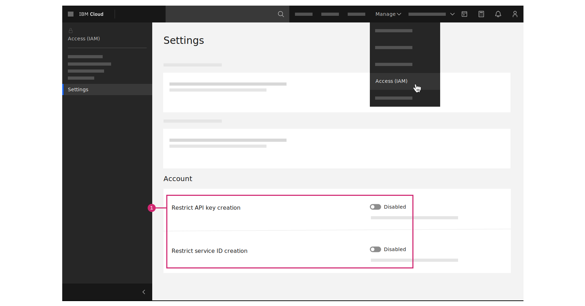

---

copyright:
  years: 2020, 2022
lastupdated: "2022-01-04"

keywords: unable to configure IAM credentials engine, can't create API key, access required for IAM credentials engine

subcollection: secrets-manager

content-type: troubleshoot

---

{:codeblock: .codeblock}
{:screen: .screen}
{:download: .download}
{:external: target="_blank" .external}
{:faq: data-hd-content-type='faq'}
{:gif: data-image-type='gif'}
{:important: .important}
{:note: .note}
{:pre: .pre}
{:tip: .tip}
{:preview: .preview}
{:deprecated: .deprecated}
{:beta: .beta}
{:term: .term}
{:shortdesc: .shortdesc}
{:script: data-hd-video='script'}
{:support: data-reuse='support'}
{:table: .aria-labeledby="caption"}
{:troubleshoot: data-hd-content-type='troubleshoot'}
{:help: data-hd-content-type='help'}
{:tsCauses: .tsCauses}
{:tsResolve: .tsResolve}
{:tsSymptoms: .tsSymptoms}
{:video: .video}
{:step: data-tutorial-type='step'}
{:tutorial: data-hd-content-type='tutorial'}
{:api: .ph data-hd-interface='api'}
{:cli: .ph data-hd-interface='cli'}
{:ui: .ph data-hd-interface='ui'}
{:curl: .ph data-hd-programlang='curl'}
{:java: .ph data-hd-programlang='java'}
{:ruby: .ph data-hd-programlang='ruby'}
{:c#: .ph data-hd-programlang='c#'}
{:objectc: .ph data-hd-programlang='Objective C'}
{:python: .ph data-hd-programlang='python'}
{:javascript: .ph data-hd-programlang='javascript'}
{:php: .ph data-hd-programlang='PHP'}
{:swift: .ph data-hd-programlang='swift'}
{:curl: .ph data-hd-programlang='curl'}
{:dotnet-standard: .ph data-hd-programlang='dotnet-standard'}
{:go: .ph data-hd-programlang='go'}
{:unity: .ph data-hd-programlang='unity'}
{:release-note: data-hd-content-type='release-note'}


# Why can't I configure the IAM credentials engine?
{: #troubleshoot-IAM-secrets-engine}
{: troubleshoot}
{: support}

You try to configure the IAM credentials engine in an {{site.data.keyword.secrets-manager_full}} instance, but you're unable to do so.
{: shortdesc}

In the {{site.data.keyword.secrets-manager_short}} UI, you go to the **Secrets engines** page to configure the IAM credentials engine. You receive the following error message when you try to create an API key:
{: tsSymptoms}

```plaintext
Access required
You're not authorized to complete this action. To verify your permissions, contact your administrator.
```
{: screen}

You verify with an account owner that you already have [**Manager** service access](/docs/secrets-manager?topic=secrets-manager-iam#iam-roles-actions) to {{site.data.keyword.secrets-manager_short}}, but you're still unable to configure the IAM credentials engine for the instance.

You need extra permissions to [create service ID API keys](/docs/account?topic=account-account-services#identity-service-account-management) in the account. In some cases, API key and service ID creation might also be restricted on the account.
{: tsCauses}

First, verify with the account owner that you're assigned the following IAM permissions:
{: tsResolve}

- **Administrator** platform access on the IAM Access Groups Service.
- **Administrator** platform access on the IAM Identity Service.
- **Manager** service access on the {{site.data.keyword.secrets-manager_short}} instance.

If the updated access permissions do not resolve the issue, verify with the account owner that the [**Restrict API key creation**](/docs/account?topic=account-allow-api-create) and [**Restrict service ID creation**](/docs/account?topic=account-restrict-service-id-create) options are disabled on the account.

{: caption="Figure 1. Disabling API key and service ID restrictions" caption-side="bottom"}


If the problem persists, contact {{site.data.keyword.cloud_notm}} support.

