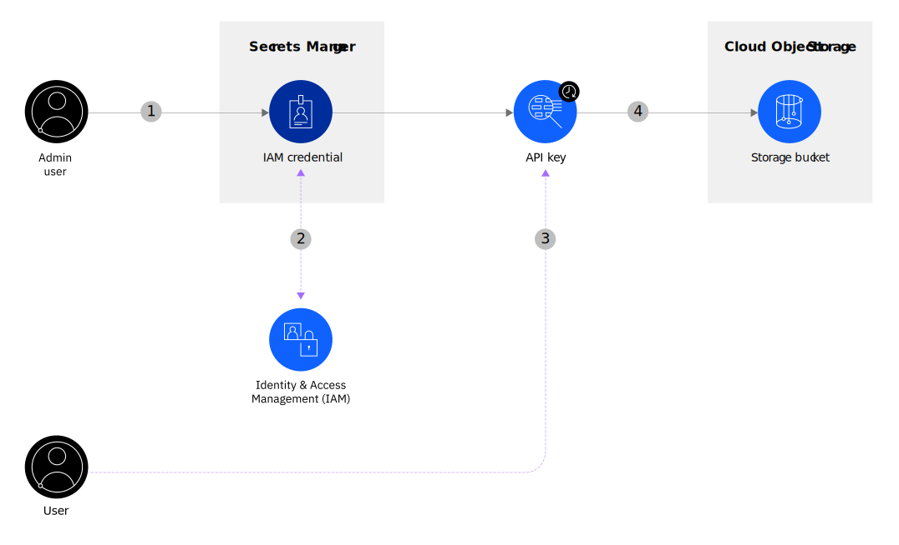

---

copyright:
  years: 2020, 2023
lastupdated: "2023-04-19"
content-type: tutorial
services: secrets-manager, cloud-object-storage
account-plan: paid
completion-time: 1h

keywords: create API key for Cloud Object Storage, use Secrets Manager to create API key, dynamic API key, connecting to Cloud Object Storage, authenticating to Cloud Object Storage, using dynamic secrets, what is a dynamic secret, Secrets Manager use case

subcollection: secrets-manager

---

{:codeblock: .codeblock}
{:screen: .screen}
{:download: .download}
{:external: target="_blank" .external}
{:faq: data-hd-content-type='faq'}
{:gif: data-image-type='gif'}
{:important: .important}
{:note: .note}
{:pre: .pre}
{:tip: .tip}
{:preview: .preview}
{:deprecated: .deprecated}
{:beta: .beta}
{:term: .term}
{:shortdesc: .shortdesc}
{:script: data-hd-video='script'}
{:support: data-reuse='support'}
{:table: .aria-labeledby="caption"}
{:troubleshoot: data-hd-content-type='troubleshoot'}
{:help: data-hd-content-type='help'}
{:tsCauses: .tsCauses}
{:tsResolve: .tsResolve}
{:tsSymptoms: .tsSymptoms}
{:video: .video}
{:step: data-tutorial-type='step'}
{:tutorial: data-hd-content-type='tutorial'}
{:api: .ph data-hd-interface='api'}
{:cli: .ph data-hd-interface='cli'}
{:ui: .ph data-hd-interface='ui'}
{:terraform: .ph data-hd-interface="terraform"}
{:curl: .ph data-hd-programlang='curl'}
{:java: .ph data-hd-programlang='java'}
{:ruby: .ph data-hd-programlang='ruby'}
{:c#: .ph data-hd-programlang='c#'}
{:objectc: .ph data-hd-programlang='Objective C'}
{:python: .ph data-hd-programlang='python'}
{:javascript: .ph data-hd-programlang='javascript'}
{:php: .ph data-hd-programlang='PHP'}
{:swift: .ph data-hd-programlang='swift'}
{:curl: .ph data-hd-programlang='curl'}
{:dotnet-standard: .ph data-hd-programlang='dotnet-standard'}
{:go: .ph data-hd-programlang='go'}
{:unity: .ph data-hd-programlang='unity'}
{:release-note: data-hd-content-type='release-note'}


# Access a storage bucket by using a dynamic secret
{: #tutorial-access-storage-bucket}
{: toc-content-type="tutorial"}
{: toc-services="secrets-manager, cloud-object-storage"}
{: toc-completion-time="1h"}

In this tutorial, you learn how to use {{site.data.keyword.secrets-manager_full}} to create and lease an IAM credential that can be used to access a bucket in Cloud Object Storage.
{: shortdesc}

As an enterprise developer, you might be looking for ways to improve the security of your application secrets. When it comes to managing API keys, you want the ability to create your credentials dynamically so that they exist only when you need them to. You also want to lease an API key to someone else on your team and ensure that it is automatically revoked after a time duration that you specify.

With {{site.data.keyword.secrets-manager_short}}, you can create a [dynamic secret](#x9968958){: term} that you can use to access a protected resource, such as deployment logs that you store in a Cloud Object Storage bucket. For example, consider the following scenario.

{: caption="Figure 1. IAM credential flow" caption-side="bottom"}

1. As an admin user, you want to create a dynamic secret that your team can use to access a Cloud Object Storage bucket in your account. You send a request to create IAM credentials in {{site.data.keyword.secrets-manager_short}}.
2. {{site.data.keyword.secrets-manager_short}} creates the secret and validates it against your defined IAM access policies.
3. Later, a developer wants to access the contents of your storage bucket. The developer sends a request to retrieve the value of your IAM credential.
4. {{site.data.keyword.secrets-manager_short}} validates the request and generates a single-use API key that the developer can use to authenticate to Cloud Object Storage. After the API key reaches the end of its lease, the API key is revoked automatically.

## Before you begin
{: #access-cos-prereqs}

Before you get started, be sure that you have [**Administrator** platform access](/docs/account?topic=account-assign-access-resources#assign-new-access) so that you can provision services, create access groups, and customize access policies for others. You also need the following prerequisites:

- [Download and install the IBM Cloud CLI](/docs/cli).
- [Install the {{site.data.keyword.secrets-manager_short}} CLI plug-in](/docs/secrets-manager?topic=secrets-manager-cli-plugin-secrets-manager-cli).
- [Download and install jq](https://stedolan.github.io/jq/){: external}.

    `jq` helps you slice and filter JSON data. You use `jq` in this tutorial to grab and use stored environment variables.

## Set up your environment
{: #access-cos-configure-env}
{: step}

To work with {{site.data.keyword.secrets-manager_short}} and Cloud Object Storage, you need to create instances of both services in your {{site.data.keyword.cloud_notm}} account. You also need to configure permissions so that you can run operations against both services.

In this step, you set up an access environment by creating an access group, a service ID, and an {{site.data.keyword.cloud_notm}} API key. At the end of the tutorial, you can easily remove both instances if you no longer need them.

You can have only one {{site.data.keyword.secrets-manager_short}} service instance in your {{site.data.keyword.cloud_notm}} account.
{: note}

### Create {{site.data.keyword.secrets-manager_short}} and Cloud Object Storage instances
{: #access-cos-create-instances}

Start by creating test instances of {{site.data.keyword.secrets-manager_short}} and Cloud Object Storage in your {{site.data.keyword.cloud_notm}} account.

1. On the command line, log in to {{site.data.keyword.cloud_notm}} through the [{{site.data.keyword.cloud_notm}} CLI](/docs/cli?topic=cli-install-ibmcloud-cli).

    ```sh
    ibmcloud login
    ```
    {: pre}

    If the login fails, run the `ibmcloud login --sso` command to try again. The `--sso` parameter is required when you log in with a federated ID. If this option is used, go to the link listed in the CLI output to generate a one-time passcode.
    {: note}

2. Select the account, region, and resource group where you want to create a {{site.data.keyword.secrets-manager_short}} service instance.

    In this tutorial, you interact with the Dallas region. If you're logged in to a different region, be sure to set Dallas as your target region by running the following command.

    ```sh
    ibmcloud target -r us-south -g default
    ```
    {: pre}

3. Create a Cloud Object Storage instance.

    ```sh
    ibmcloud resource service-instance-create test-cos-instance-tutorial cloud-object-storage lite us-south
    ```
    {: pre}

4. Create a {{site.data.keyword.secrets-manager_short}} instance.

    ```sh
    ibmcloud resource service-instance-create test-sm-instance-tutorial secrets-manager lite us-south
    ```
    {: pre}

    The provisioning process for {{site.data.keyword.secrets-manager_short}} takes 5 - 15 minutes to complete.
    {: note}

5. Export environment variables with the IDs of both service instances.

    ```sh
    export COS_INSTANCE_ID=`ibmcloud resource service-instance "test-cos-instance-tutorial" --output json | jq -r ".[].guid"`; echo $COS_INSTANCE_ID
    ```
    {: pre}

    ```sh
    export SM_INSTANCE_ID=`ibmcloud resource service-instance "test-sm-instance-tutorial" --output json | jq -r ".[].guid"`; echo $SM_INSTANCE_ID
    ```
    {: pre}

6. (Optional) Verify that your services were created successfully by clicking the **Menu** icon  **> Resource List** in your {{site.data.keyword.cloud_notm}} console.


### Set up access permissions
{: #access-cos-prepare-access}

Next, define the access hierarchy that you need to be able to run operations against the {{site.data.keyword.secrets-manager_short}} and Cloud Object Storage services.

1. Create a test access group in your {{site.data.keyword.cloud_notm}} account.

    By creating an access group, you're able to assign access to the set of users and service IDs that require access to your {{site.data.keyword.secrets-manager_short}} and Cloud Object Storage instances. From the command line, run the following command to create a new access group called `test-cos-admin-group`.

    ```sh
    export ACCESS_GROUP_ID=`ibmcloud iam access-group-create test-storage-admin-group -d "An access group for testing Secrets Manager and Cloud Object Storage." --output json | jq -r ".id"`; echo $ACCESS_GROUP_ID
    ```
    {: pre}

2. Set up your account credentials.

    Create a service ID and set it as an environment variable.

    ```sh
    export SERVICE_ID=`ibmcloud iam service-id-create test-service-id-secrets --description "A service ID for testing Secrets Manager." --output json | jq -r ".id"`; echo $SERVICE_ID
    ```
    {: pre}

    Assign the service ID permissions to create and manage other service IDs.

    ```sh
    ibmcloud iam service-policy-create $SERVICE_ID --roles Operator --service-name "IAM Identity Service"
    ```
    {: pre}

    Assign the service ID permissions to view and update access groups in your account.

    ```sh
    ibmcloud iam access-group-policy-create $SERVICE_ID --roles Editor --service-name "IAM Access Groups"
    ```
    {: pre}

    Add the service ID to your access group.

    ```sh
    ibmcloud iam access-group-service-id-add test-secrets-admin-group $SERVICE_ID
    ```
    {: pre}

    Create an {{site.data.keyword.cloud_notm}} API key for your service ID.

    ```sh
    export IBM_CLOUD_API_KEY=`ibmcloud iam service-api-key-create test-storage-read-write $SERVICE_ID --description "An API key for testing Secrets Manager and Cloud Object Storage." --output json | jq -r ".apikey"`
    ```
    {: pre}

    You use this API key later to enable the {{site.data.keyword.secrets-manager_short}} IAM secrets engine.


### Prepare your Cloud Object Storage instance
{: #access-cos-provision-cos}

Next, create a bucket in your Cloud Object Storage instance and set up access.

1. Create a test bucket in your instance.

    1. In the IBM Cloud console, go to your **Resource List**.
    2. From your list of storage services, select _test-cos-instance-tutorial_.
    3. In the Cloud Object Storage UI, click **Create bucket**.
    4. Create a bucket in the `us-south` region.
    5. Copy the ID of the bucket.

2. Assign read and write access to your new Cloud Object Storage bucket.

    1. Go to **Manage > Access (IAM) > Access groups**.
    2. From your list of groups, select _test-storage-admin-group_.
    3. Click the _Access_ tab.
    4. Click **Assign access**.
    6. From the list of services, select **Cloud Object Storage** and click **Next**.
    7. In the Resources section, select **Specific resources**.
    8. In the Attribute type field, select **Service instance**.
    9. From the list of service instances, select _test-cos-instance-tutorial_ and click **Next**.
    8. Assign the **Reader**, **Content Reader**, **Object Reader**, and **Object Writer** service access roles.
    9. Review your selections and click **Add**.
    10. Click **Assign**.

3. Upload an object to the storage bucket.

    You can drag and drop any file or folder from your local system. For example, you can create and upload a file that is named `sample.txt` with the following sample text.

    ```plaintext
    A quick brown fox jumped over the lazy dog.
    ```
    {: screen}

### Prepare your {{site.data.keyword.secrets-manager_short}} instance
{: #access-cos-provision-sm}

Finally, configure your {{site.data.keyword.secrets-manager_short}} instance to start working with dynamic secrets.

1. From the command line, verify that you can access the {{site.data.keyword.secrets-manager_short}} CLI plug-in.

    ```sh
    ibmcloud secrets-manager --help
    ```
    {: pre}

    Don't have the plug-in? To install the {{site.data.keyword.secrets-manager_short}} CLI plug-in, run `ibmcloud plugin install secrets-manager`.
    {: tip}

2. Export an environment variable with your unique {{site.data.keyword.secrets-manager_short}} API endpoint URL.

    ```sh
    export SECRETS_MANAGER_URL="https://$SM_INSTANCE_ID.us-south.secrets-manager.appdomain.cloud"
    ```
    {: pre}

3. Create a secret group for your instance.

    [Secret groups](/docs/secrets-manager?topic=secrets-manager-secret-groups) are a way to organize and control who on your team has access to specific secrets in your instance. To create a secret group from the {{site.data.keyword.cloud_notm}} CLI, run the [**`ibmcloud secrets-manager secret-group-create`**](/docs/secrets-manager?topic=secrets-manager-cli-plugin-secrets-manager-cli#secrets-manager-cli-secret-group-create-command) command.

    ```sh
    export SECRET_GROUP_ID=`ibmcloud secrets-manager secret-group-create --resources '[{"name":"cloud-object-storage-writers","description":"Read and write to Cloud Object storage buckets."}]' --output json | jq -r ".resources[].id"`; echo $SECRET_GROUP_ID
    ```
    {: pre}

    Using a Windows™ command prompt (`cmd.exe`) or PowerShell? If you encounter errors with passing JSON content on the command line, you might need to adjust the strings for quotation-escaping requirements that are specific to your operating system. For more information, see [Using quotation marks with strings in the {{site.data.keyword.cloud_notm}} CLI](/docs/cli?topic=cli-quote-strings).
    {: tip}

    If you run into the following error: `Error processing the response received, most likely an error response: Get "https://secrets-manager.cloud.ibm.com/api/v1/secret_groups": dial tcp: lookup secrets-manager.cloud.ibm.com on 1.1.1.1:53: no such host`, be sure that you export an environment variable with your unique {{site.data.keyword.secrets-manager_short}} API endpoint URL as shown in the previous step.
    {: note}

4. Enable the IAM secrets engine for your instance.

    Secret engines are components in {{site.data.keyword.secrets-manager_short}} that are used to process operations for secrets of different types. These engines serve as backends for those secrets. By enabling the IAM secrets engine, you can create an API key for a service ID dynamically, and then lease it to a user based on the lease duration that you specify.

    To configure the IAM secrets engine from the {{site.data.keyword.cloud_notm}} CLI, run the [**`ibmcloud secrets-manager config-update`**](/docs/secrets-manager?topic=secrets-manager-cli-plugin-secrets-manager-cli#secrets-manager-cli-config-update-command) command.

    ```sh
    ibmcloud secrets-manager config-update --engine-config '{"api_key": "$API_KEY"}'
    ```
    {: pre}

    Success! Now you can [create an IAM credential](/docs/secrets-manager?topic=secrets-manager-iam-credentials#iam-credentials-ui) that you can use to dynamically generate service IDs and API keys. Continue to the next step.


## Create an IAM credential
{: #access-cos-create-iam-credential}
{: step}

IAM credentials are dynamic secrets that you can use to access an IBM Cloud resource on-demand, such as a Cloud Object Storage bucket. A set of IAM credentials consists of a service ID and an API key that is generated each time that the protected resource is read or accessed. You can define a time-to-live (TTL) or a lease duration for your IAM credential at its creation so that you shorten the amount of time that the secret exists.

To create an IAM credential from the {{site.data.keyword.cloud_notm}} CLI, run the [**`ibmcloud secrets-manager secret-create`**](/docs/secrets-manager?topic=secrets-manager-cli-plugin-secrets-manager-cli#secrets-manager-cli-secret-create-command) command.


```sh
export SECRET_ID=`ibmcloud secrets-manager secret-create --resources '[{"name":"test-iam-credentials","description":"Extended description for my secret.","access_groups":["$ACCESS_GROUP_ID"],"secret_group_id":"$SECRET_GROUP_ID","ttl":"2h","labels":["storage","us-south"]}]' --output json | jq -r ".resources[].id"`
```
{: pre}

You can also create an IAM credential by using the {{site.data.keyword.secrets-manager_short}} UI. For more information, see [Creating IAM credentials](/docs/secrets-manager?topic=secrets-manager-iam-credentials).
{: note}

## Generate an API key
{: #access-cos-retrieve-api-key}
{: step}

After you create the IAM credential, a user with lesser privileges can retrieve the secret when it's time to access the storage bucket.

To retrieve an IAM credential from the {{site.data.keyword.cloud_notm}} CLI, you can run the [**`ibmcloud secrets-manager secret`**](/docs/secrets-manager?topic=secrets-manager-cli-plugin-secrets-manager-cli#secrets-manager-cli-secret-command) command.

1. Retrieve the contents of your IAM credential secret.

    ```sh
    ibmcloud secrets-manager secret --id $SECRET_ID --output json
    ```
    {: pre}

    The following JSON snippet shows the example response.

    ```json
    {
        "metadata": {
        "collection_type": "application/vnd.ibm.secrets-manager.secret+json",
        "collection_total": 1
        },
        "resources": [
        {
          "access_groups": [
            "AccessGroupId-e7e1a364-c5b9-4027-b4fe-083454499a20"
          ],
          "api_key": "pVTL3W7o1uqIWSE8sSh8ebNhRN4-d1D0W9GcPVgwcLUr",
          "created_by": "iam-ServiceId-222b47ab-b08e-4619-b68f-8014a2c3acb8",
          "creation_date": "2020-12-15T14:31:42Z",
          "crn": "crn:v1:bluemix:public:secrets-manager:us-south:a/a5ebf2570dcaedf18d7ed78e216c263a:f1bc94a6-64aa-4c55-b00f-f6cd70e4b2ce:secret:cb7a2502-8ede-47d6-b5b6-1b7af6b6f563",
          "description": "Extended description for my secret.",
          "labels": [
              "storage",
              "us-south"
          ],
          "last_update_date": "2020-12-15T14:31:42Z",
          "name": "test-iam-credentials",
          "secret_group_id": "432b91f1-ff6d-4b47-9f06-82debc236d90",
          "secret_type": "IAM_CREDENTIALS",
          "service_id": "ServiceId-0576925a-9651-4f3e-b8c7-ce1332324aa4",
          "state": 1,
          "state_description": "Active",
          "ttl": 900
        }
        ]
    }
    ```
    {: screen}

    The response body shows the single-use `api_key` and `service_id` values that are generated for your secret. The `ttl` value indicates how long your credentials are valid (in seconds).

2. Export an environment variable with the newly generated API key.

    Copy the `api_key` value that you generated in the previous step, and set it as an environment variable.

    ```sh
    export API_key="<api_key>"
    ```
    {: pre}


## Use the API key to generate an access token
{: #access-cos-generate-access-token}
{: step}

By using the API key that you retrieved in the previous step, you can generate an IAM access token. The token is valid only for the duration that you initially defined for the IAM credential.

You can exchange the API key for an IAM access token by calling [IAM Identity Services API](/apidocs/iam-identity-token-api){: external}. To generate an IAM token, run the following cURL command from your command line.

```sh
export IAM_TOKEN=`curl -X POST \
    "https://iam.cloud.ibm.com/identity/token" \
    -H "Content-Type: application/x-www-form-urlencoded" \
    -H "Accept: application/json" \
    -d "grant_type=urn%3Aibm%3Aparams%3Aoauth%3Agrant-type%3Aapikey&apikey=$API_KEY" | jq -r ".access_token"`; echo $IAM_TOKEN
```
{: codeblock}

Success! You now have a valid IAM token that you can use to access your Cloud Object Storage bucket. Continue to the next step.

## Access a storage bucket
{: #access-cos-bucket}
{: step}

As a user with lesser privileges, you can now read and write to your Cloud Object Storage bucket by using the access token that you generated in the previous step. After the lease duration of your IAM credentials expires, its associated API key is revoked automatically.

On the command line, run the following cURL request to list the buckets in your Cloud Object Storage instance.

```sh
curl -X GET \
    "https://s3.us-south.cloud-object-storage.appdomain.cloud" \
    -H "Authorization: Bearer $IAM_TOKEN" \
    -H "ibm-service-instance-id: $COS_INSTANCE_ID" \
    -H "Accept: application/json"
```
{: codeblock}

The following XML snippet shows an example response.

```xml
<ListAllMyBucketsResult xmlns="http://s3.amazonaws.com/doc/2006-03-01/">
    <Owner>
        <ID>cccbd89c-6eb0-4aed-8ffb-899d39bc022e</ID>
        <DisplayName>cccbd89c-6eb0-4aed-8ffb-899d39bc022e</DisplayName>
    </Owner>
    <Buckets>
        <Bucket>
            <Name>test-secrets-tutorial</Name>
            <CreationDate>2020-12-14T21:40:55.739Z</CreationDate>
        </Bucket>
    </Buckets>
</ListAllMyBucketsResult>
```
{: screen}

To see the contents of your `test-secrets-tutorial` bucket, you can run the following command.

```sh
curl -X GET \
    "https://s3.us-south.cloud-object-storage.appdomain.cloud/test-secrets-tutorial" \
    -H "Authorization: Bearer $IAM_TOKEN" \
    -H "ibm-service-instance-id: $COS_INSTANCE_ID" \
    -H "Accept: application/json"
```
{: codeblock}

The following XML snippet shows an example response.

```xml
<?xml version="1.0" encoding="UTF-8" standalone="yes"?>
<ListBucketResult xmlns="http://s3.amazonaws.com/doc/2006-03-01/">
    <Name>test-secrets-tutorial</Name>
    <Prefix></Prefix>
    <Marker></Marker>
    <MaxKeys>1000</MaxKeys>
    <Delimiter></Delimiter>
    <IsTruncated>false</IsTruncated>
    <Contents>
        <Key>sample.txt</Key>
        <LastModified>2020-12-14T21:49:29.502Z</LastModified>
        <ETag>"df756a3769fcab0a261880957590c768"</ETag>
        <Size>42</Size>
        <Owner>
            <ID>cccbd89c-6eb0-4aed-8ffb-899d39bc022e</ID>
            <DisplayName>cccbd89c-6eb0-4aed-8ffb-899d39bc022e</DisplayName>
        </Owner>
        <StorageClass>STANDARD</StorageClass>
    </Contents>
</ListBucketResult>
```
{: screen}

Finally, to read the object in the bucket, you can run the following command.

```sh
curl -X GET \
    "https://s3.us-south.cloud-object-storage.appdomain.cloud/test-secrets-tutorial/sample.txt" \
    -H "Authorization: Bearer $IAM_TOKEN" \
    -H "ibm-service-instance-id: $COS_INSTANCE_ID" \
    -H "Accept: application/json"
```
{: codeblock}

Replace `sample.txt` with the name of the file that you uploaded to your bucket. The following screen shows an example response.

```plaintext
A quick brown fox jumps over the lazy dog.
```
{: screen}

## (Optional) Clean up resources
{: #access-cos-clean-up}
{: step}

If you no longer need the resources that you created in this tutorial, you can complete the following steps to remove them from your account.

1. Delete your test Cloud Object Storage instance.

    ```sh
    ibmcloud resource service-instance-delete test-cos-instance-tutorial
    ```
    {: pre}

2. Delete your test {{site.data.keyword.secrets-manager_short}} instance.

    ```sh
    ibmcloud resource service-instance-delete test-sm-instance-tutorial
    ```
    {: pre}

3. Delete your test access group.

    ```sh
    ibmcloud resource access-group-delete $ACCESS_GROUP
    ```
    {: pre}

4. Delete your test service ID.

    ```sh
    ibmcloud resource service-id-delete $SERVICE_ID
    ```
    {: pre}

## Next steps
{: #access-cos-next-steps}

Great job! In this tutorial, you learned how to set up {{site.data.keyword.secrets-manager_short}} to access a Cloud Object Storage bucket with a dynamic secret. Check out more resources to help you get started with {{site.data.keyword.secrets-manager_short}}.

- Learn more about [secret types](/docs/secrets-manager?topic=secrets-manager-what-is-secret).
- Design an access strategy with [secret groups](/docs/secrets-manager?topic=secrets-manager-secret-groups).
- Learn more about the [{{site.data.keyword.secrets-manager_short}} API](/apidocs/secrets-manager){: external}.


