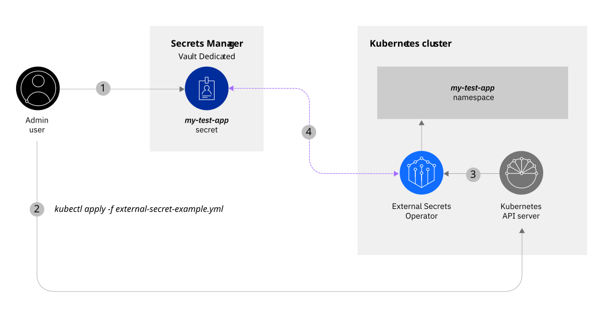

---


copyright:
  years: 2026
lastupdated: "2026-08-31"

keywords: tutorial, Vault as a Service, Kubernetes secrets, External Secrets Operator

subcollection: secrets-manager
content-type: tutorial
services: secrets-manager,containers
account-plan: paid
completion-time: 45m

---

{:codeblock: .codeblock}
{:screen: .screen}
{:download: .download}
{:external: target="_blank" .external}
{:faq: data-hd-content-type='faq'}
{:gif: data-image-type='gif'}
{:important: .important}
{:note: .note}
{:pre: .pre}
{:tip: .tip}
{:preview: .preview}
{:deprecated: .deprecated}
{:beta: .beta}
{:term: .term}
{:shortdesc: .shortdesc}
{:script: data-hd-video='script'}
{:support: data-reuse='support'}
{:table: .aria-labeledby="caption"}
{:troubleshoot: data-hd-content-type='troubleshoot'}
{:help: data-hd-content-type='help'}
{:tsCauses: .tsCauses}
{:tsResolve: .tsResolve}
{:tsSymptoms: .tsSymptoms}
{:video: .video}
{:step: data-tutorial-type='step'}
{:tutorial: data-hd-content-type='tutorial'}
{:api: .ph data-hd-interface='api'}
{:cli: .ph data-hd-interface='cli'}
{:ui: .ph data-hd-interface='ui'}
{:terraform: .ph data-hd-interface="terraform"}
{:curl: .ph data-hd-programlang='curl'}
{:java: .ph data-hd-programlang='java'}
{:ruby: .ph data-hd-programlang='ruby'}
{:c#: .ph data-hd-programlang='c#'}
{:objectc: .ph data-hd-programlang='Objective C'}
{:python: .ph data-hd-programlang='python'}
{:javascript: .ph data-hd-programlang='javascript'}
{:php: .ph data-hd-programlang='PHP'}
{:swift: .ph data-hd-programlang='swift'}
{:curl: .ph data-hd-programlang='curl'}
{:dotnet-standard: .ph data-hd-programlang='dotnet-standard'}
{:go: .ph data-hd-programlang='go'}
{:unity: .ph data-hd-programlang='unity'}
{:release-note: data-hd-content-type='release-note'}


# Secure secrets for apps with Vault Dedicated and External Secrets Operator
{: #tutorial-vault-kubernetes-secrets-eso}
{: toc-content-type="tutorial"}
{: toc-services="vault,containers"}
{: toc-completion-time="45m"}

In this tutorial, you learn how to use IBM Cloud Vault Enterprise to manage secrets for applications that run in your {{site.data.keyword.containerfull_notm}} cluster by using the [External Secrets Operator](https://external-secrets.io/latest/){: external} open-source tool.

{: shortdesc}

You're a developer in an organization, and your team is using {{site.data.keyword.containershort}} to deploy containerized apps and services on {{site.data.keyword.cloud_notm}}. You want to store your application secrets in Vault Dedicated, IBM Cloud's managed HashiCorp Vault service, where you can encrypt them at rest, manage their lifecycle, and easily rotate them.

With Vault Dedicated and External Secrets Operator, you can centralize and secure the secrets that are used by the apps that run in your Kubernetes clusters. Rather than injecting your secrets at deployment time, you can configure your apps to securely retrieve secrets from Vault Dedicated at run time. For example, consider the following scenario:

{: caption="External Secrets flow" caption-side="bottom"}

1. As a developer, you use Vault Dedicated to store a secret for an application that you want to deploy in a Kubernetes cluster.
2. You configure the External Secrets Operator to connect to your Vault Dedicated instance using the HashiCorp Vault provider.
3. The External Secrets controller fetches the `ExternalSecrets` objects in the configuration file that you defined by using the Kubernetes API.
4. At application run time, the controller retrieves the secret data from Vault Dedicated, and converts the `ExternalSecrets` objects to Kubernetes secrets for your cluster.

This scenario features a third-party tool that can impact the compliance readiness of workloads that run in your Kubernetes cluster. If you add a community or third-party tool, keep in mind that you are responsible for maintaining the compliance of your apps, and working with the appropriate provider to troubleshoot any issues. For more information, see [Your responsibilities with using {{site.data.keyword.containerfull_notm}}](/docs/containers?topic=containers-responsibilities_iks).
{: note}

## Before you begin
{: #tutorial-vault-kubernetes-secrets-eso-prereqs}

Before you get started, be sure that you have [**Administrator** platform access](/docs/secrets-manager?topic=secrets-manager-assign-access) so that you can create account credentials and provision resources. You also need the following prerequisites:

- [Download and install the IBM Cloud CLI](/docs/cli).
- [Install the Kubernetes CLI (`kubectl`)](https://kubernetes.io/docs/tasks/tools/){: external}.
- [Install Helm 3.x](https://helm.sh/docs/intro/install/){: external}.
- [Download and install `jq`](https://stedolan.github.io/jq/){: external}.

    `jq` helps you slice and filter JSON data. You use `jq` in this tutorial to grab and use stored environment variables.

- A Vault Dedicated Instance provisioned in your {{site.data.keyword.cloud_notm}} account. For more information, see [Setting up your Vault Dedicated instance](/docs//secrets-manager?topic=secrets-manager-setting-up-vault-dedicated-instance).

## Set up your environment
{: #tutorial-vault-kubernetes-secrets-eso-set-up-env}
{: step}

To work with Vault Dedicated and {{site.data.keyword.containershort}}, you need to create a cluster in your {{site.data.keyword.cloud_notm}} account and configure access to your Vault Dedicated instance.

### Create a Kubernetes cluster
{: #tutorial-vault-kubernetes-secrets-eso-prepare-cluster}

Create a Kubernetes cluster in your {{site.data.keyword.cloud_notm}} account.

1. From the command line, log in to {{site.data.keyword.cloud_notm}} through the [{{site.data.keyword.cloud_notm}} CLI](/docs/cli?topic=cli-install-ibmcloud-cli).

    ```sh
    ibmcloud login
    ```
    {: pre}

    If the login fails, run the `ibmcloud login --sso` command to try again. The `--sso` parameter is required when you log in with a federated ID. If this option is used, go to the link listed in the CLI output to generate a one-time passcode.
    {: note}

2. Select the account, region, and resource group where you want to create your cluster.

    ```sh
    ibmcloud target -r <region> -g <resource_group>
    ```
    {: pre}

    Replace `<region>` with your target region (for example, `au-syd`) and `<resource_group>` with your resource group name.

3. Create a Kubernetes cluster.

    ```sh
    ibmcloud ks cluster create vpc-gen2 --zone <zone> --flavor <flavor> --workers 1 --name eso-test-cluster --vpc-id <VPC_ID> --subnet-id <SUBNET_ID>
    ```
    {: pre}

    Replace `<zone>`, `<flavor>`, `<VPC_ID>`, and `<SUBNET_ID>` with your values. Provisioning your Kubernetes cluster takes 5 - 15 minutes to complete.

4. Before you continue to the next step, verify that your cluster is provisioned successfully.

    ```sh
    ibmcloud ks worker ls --cluster eso-test-cluster
    ```
    {: pre}

    When your worker node is finished provisioning, the status changes to **Ready**.

5. Set the context for your Kubernetes cluster in the CLI.

    ```sh
    ibmcloud ks cluster config --cluster eso-test-cluster
    ```
    {: pre}

6. Verify that `kubectl` commands run properly and that the Kubernetes context is set to your cluster.

    ```sh
    kubectl config current-context
    ```
    {: pre}

### Prepare your Vault Dedicated instance
{: #tutorial-vault-kubernetes-secrets-eso-prepare-vault}

Configure your Vault Dedicated instance to start working with secrets and set up authentication for External Secrets Operator.

1. Export environment variables with your Vault Dedicated instance details.

    ```sh
    export VAULT_DEDICATED_ADDR="https://<your-vault_dedicated-instance-id>.vault.<region>.appdomain.cloud"
    export VAULT_DEDICATED_NAMESPACE="admin"
    ```
    {: pre}

    Replace `<your-vault_dedicated-instance-id>` with your Vault Dedicated instance ID and `<region>` with your Vault Dedicated region (for example, `au-syd`).

2. Get a Vault token from your Vault Dedicated instance.

    You can generate a token from the Vault Dedicated UI or by using the Vault CLI. For development and testing, you can use a root token. For production, create a token with appropriate policies.

    ```sh
    export VAULT_TOKEN="<your-vault-token>"
    ```
    {: pre}

3. Verify the KV secrets engine mount point in Vault Dedicated.

    Vault Dedicated instances have the KV v2 secrets engine mounted at `kv/` by default. You can verify this in the Vault Dedicated UI or by listing mounts.

    ```sh
    curl -k -X GET \
      -H "X-Vault-Token: $VAULT_TOKEN" \
      -H "X-Vault-Namespace: $VAULT_DEDICATED_NAMESPACE" \
      $VAULT_DEDICATED_ADDR/v1/sys/mounts | jq
    ```
    {: pre}

4. Create a test secret in Vault Dedicated.

    ```sh
    curl -k -X POST \
      -H "X-Vault-Token: $VAULT_TOKEN" \
      -H "X-Vault-Namespace: $VAULT_DEDICATED_NAMESPACE" \
      -d '{"data":{"username":"user123","password":"cloudy-rainy-coffee-book"}}' \
      $VAULT_DEDICATED_ADDR/v1/kv/data/example_username_password
    ```
    {: pre}

    Note that Vault Dedicated uses `kv/` as the mount path for the KV secrets engine.

5. Verify the secret was created.

    ```sh
    curl -k -X GET \
      -H "X-Vault-Token: $VAULT_TOKEN" \
      -H "X-Vault-Namespace: $VAULT_DEDICATED_NAMESPACE" \
      $VAULT_DEDICATED_ADDR/v1/kv/data/example_username_password | jq
    ```
    {: pre}


## Install External Secrets Operator
{: #tutorial-vault-kubernetes-secrets-eso-install}
{: step}

Install External Secrets Operator using Helm.

1. Add the External Secrets Helm repository.

    ```sh
    helm repo add external-secrets https://charts.external-secrets.io
    helm repo update
    ```
    {: pre}

2. Install External Secrets Operator.

    ```sh
    helm install external-secrets \
      external-secrets/external-secrets \
      --namespace external-secrets \
      --create-namespace \
      --set installCRDs=true
    ```
    {: pre}

3. Verify the installation.

    ```sh
    kubectl get pods -n external-secrets
    ```
    {: pre}

    Wait until all pods are in **Running** state.

4. Verify the Custom Resource Definitions (CRDs) are installed.

    ```sh
    kubectl get crd | grep external-secrets
    ```
    {: pre}

    You should see CRDs like `secretstores`, `clustersecretstores`, and `externalsecrets`.


## Configure SecretStore for Vault Dedicated
{: #tutorial-vault-kubernetes-secrets-eso-configure}
{: step}

Create a `SecretStore` resource that defines how External Secrets Operator connects to your Vault Dedicated instance.

1. Create a Kubernetes secret with your Vault token.

    ```sh
    kubectl create secret generic vault-token \
      --namespace external-secrets \
      --from-literal=token="$VAULT_TOKEN"
    ```
    {: pre}

2. Create a `secretstore.yaml` file.

    ```sh
    touch secretstore.yaml
    ```
    {: pre}

3. Add the following configuration to the file.

    ```yaml
    apiVersion: external-secrets.io/v1beta1
    kind: SecretStore
    metadata:
      name: vault-dedicated-secretstore
      namespace: default
    spec:
      provider:
        vault:
          server: "<VAULT_DEDICATED_ADDR>"
          path: "kv"
          version: "v2"
          namespace: "admin"
          auth:
            tokenSecretRef:
              name: "vault-token"
              key: "token"
              namespace: "external-secrets"
    ```
    {: codeblock}

    Replace `<VAULT_DEDICATED_ADDR>` with your Vault Dedicated instance address. Note that the `path` is set to `kv`, which is the default mount point for the KV secrets engine in Vault Dedicated.

4. Apply the SecretStore configuration.

    ```sh
    kubectl apply -f secretstore.yaml
    ```
    {: pre}

5. Verify the SecretStore is valid.

    ```sh
    kubectl get secretstore vault-dedicated-secretstore -n default
    kubectl describe secretstore vault-dedicated-secretstore -n default
    ```
    {: pre}

    The status should show **Valid** if the connection to Vault Dedicated is successful.


## Create an ExternalSecret
{: #tutorial-vault-kubernetes-secrets-eso-create-externalsecret}
{: step}

Create an `ExternalSecret` resource that defines which secrets to fetch from Vault Dedicated.

1. Create an `externalsecret.yaml` file.

    ```sh
    touch externalsecret.yaml
    ```
    {: pre}

2. Add the following configuration.

    ```yaml
    apiVersion: external-secrets.io/v1beta1
    kind: ExternalSecret
    metadata:
      name: vault-dedicated-app-secret
      namespace: default
    spec:
      refreshInterval: 1h
      secretStoreRef:
        name: vault-dedicated-secretstore
        kind: SecretStore
      target:
        name: my-k8s-secret
        creationPolicy: Owner
      data:
      - secretKey: username
        remoteRef:
          key: example_username_password
          property: username
      - secretKey: password
        remoteRef:
          key: example_username_password
          property: password
    ```
    {: codeblock}

    The `refreshInterval` determines how often External Secrets Operator polls Vault Dedicated for updates. The default and recommended value is 1 hour.

3. Apply the ExternalSecret configuration.

    ```sh
    kubectl apply -f externalsecret.yaml
    ```
    {: pre}

4. Verify that the External Secrets Operator fetched the secret from Vault Dedicated.

    ```sh
    kubectl get secret my-k8s-secret -o json | jq '.data | map_values(@base64d)'
    ```
    {: pre}

    Example output:

    ```json
    {
        "password": "cloudy-rainy-coffee-book",
        "username": "user123"
    }
    ```
    {: screen}

    Success! You're now able to fetch secret data from your Vault Dedicated instance and use it in your Kubernetes cluster.


## Deploy an app to the cluster
{: #tutorial-vault-kubernetes-secrets-eso-deploy-app}
{: step}

Finally, you can deploy an application in your cluster that uses the Vault Dedicated secret. At application run time, the secret data that is fetched from Vault Dedicated is converted to a Kubernetes secret that can be used by your cluster.

1. Create a simple test deployment that uses the secret.

    ```sh
    cat <<EOF | kubectl apply -f -
    apiVersion: v1
    kind: Pod
    metadata:
      name: test-app
      namespace: default
    spec:
      containers:
      - name: app
        image: busybox
        command: ['sh', '-c', 'echo "Username: \$USERNAME"; echo "Password: \$PASSWORD"; sleep 3600']
        env:
        - name: USERNAME
          valueFrom:
            secretKeyRef:
              name: my-k8s-secret
              key: username
        - name: PASSWORD
          valueFrom:
            secretKeyRef:
              name: my-k8s-secret
              key: password
    EOF
    ```
    {: pre}

2. Check the pod logs to verify the secret was injected.

    ```sh
    kubectl logs test-app -n default
    ```
    {: pre}

    Expected output:

    ```plaintext
    Username: user123
    Password: cloudy-rainy-coffee-book
    ```
    {: screen}

Looking for more examples on how to deploy an app? Check out [Deploying Kubernetes-native apps in clusters](/docs/containers?topic=containers-deploy_app) to find out more about deploying applications.


## (Optional) Clean up resources
{: #tutorial-vault-kubernetes-secrets-eso-clean-up}
{: step}

If you no longer need the resources that you created in this tutorial, you can complete the following steps to remove them from your account.

1. Delete your test Kubernetes cluster.

    ```sh
    ibmcloud ks cluster rm --cluster eso-test-cluster
    ```
    {: pre}

2. Clean up test secrets in Vault dedicated.

    ```sh
    curl -k -X DELETE \
      -H "X-Vault-Token: $VAULT_TOKEN" \
      -H "X-Vault-Namespace: $VAULT_DEDICATED_NAMESPACE" \
      $VAULT_DEDICATED_ADDR/v1/kv/metadata/example_username_password
    ```
    {: pre}

## Notes of interest
{: #tutorial-vault-kubernetes-secrets-eso-notes}

As you construct your YAML documents, keep in mind the following considerations:

1. **Polling interval**: By default, the polling interval is set to 1 hour (`refreshInterval: 1h`) and is the preferred value. You can change this value in the ExternalSecret template. The interval can be expressed in units of `s`, `m`, or `h`.

2. **Vault Dedicated mount path**: Vault Dedicated uses `kv/` as the default mount path for the KV secrets engine, not `secret/`. Ensure you specify the correct path in your SecretStore configuration.

3. **Vault Dedicated namespaces**: Vault Dedicated uses Vault Enterprise namespaces. The default namespace is `admin`. Ensure you specify the correct namespace in your SecretStore configuration.

4. **Authentication methods**: This tutorial uses token authentication for simplicity. For production environments, consider using AppRole or Kubernetes authentication methods for better security.

5. **TLS considerations**: Vault Dedicated requires TLS connections. In production environments, ensure proper certificate validation is configured instead of using `skipTLSVerify`.


## Next steps
{: #tutorial-vault-kubernetes-secrets-eso-next-steps}

Great job! In this tutorial, you learned how to set up Vault Dedicated to securely populate application secrets to your Kubernetes cluster using External Secrets Operator. Check out more resources to help you get started with Vault Dedicated.

- Learn about [Vault Secrets Operator](/docs/secrets-manager?topic=secrets-manager-tutorial-vault-kubernetes-secrets-vso), HashiCorp's official operator for Kubernetes integration.
- Review the [External Secrets Operator Vault provider documentation](https://external-secrets.io/latest/provider/hashicorp-vault/){: external}.
- Explore [Vault Dedicated documentation](/docs/vault) for more advanced features and configurations.
- Learn more about [HashiCorp Vault](https://developer.hashicorp.com/vault/docs){: external}.
