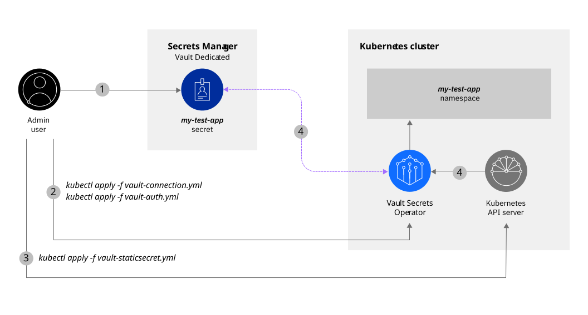

---


copyright:
  years: 2026
lastupdated: "2026-09-01"

keywords: tutorial, Vault as a Service, Kubernetes secrets, Vault Secrets Operator, VSO

subcollection: secrets-manager
content-type: tutorial
services: secrets-manager,containers
account-plan: paid
completion-time: 45m

---

{:codeblock: .codeblock}
{:screen: .screen}
{:download: .download}
{:external: target="_blank" .external}
{:faq: data-hd-content-type='faq'}
{:gif: data-image-type='gif'}
{:important: .important}
{:note: .note}
{:pre: .pre}
{:tip: .tip}
{:preview: .preview}
{:deprecated: .deprecated}
{:beta: .beta}
{:term: .term}
{:shortdesc: .shortdesc}
{:script: data-hd-video='script'}
{:support: data-reuse='support'}
{:table: .aria-labeledby="caption"}
{:troubleshoot: data-hd-content-type='troubleshoot'}
{:help: data-hd-content-type='help'}
{:tsCauses: .tsCauses}
{:tsResolve: .tsResolve}
{:tsSymptoms: .tsSymptoms}
{:video: .video}
{:step: data-tutorial-type='step'}
{:tutorial: data-hd-content-type='tutorial'}
{:api: .ph data-hd-interface='api'}
{:cli: .ph data-hd-interface='cli'}
{:ui: .ph data-hd-interface='ui'}
{:terraform: .ph data-hd-interface="terraform"}
{:curl: .ph data-hd-programlang='curl'}
{:java: .ph data-hd-programlang='java'}
{:ruby: .ph data-hd-programlang='ruby'}
{:c#: .ph data-hd-programlang='c#'}
{:objectc: .ph data-hd-programlang='Objective C'}
{:python: .ph data-hd-programlang='python'}
{:javascript: .ph data-hd-programlang='javascript'}
{:php: .ph data-hd-programlang='PHP'}
{:swift: .ph data-hd-programlang='swift'}
{:curl: .ph data-hd-programlang='curl'}
{:dotnet-standard: .ph data-hd-programlang='dotnet-standard'}
{:go: .ph data-hd-programlang='go'}
{:unity: .ph data-hd-programlang='unity'}
{:release-note: data-hd-content-type='release-note'}


# Secure secrets for apps with Vault Dedicated and Vault Secrets Operator
{: #tutorial-vault-kubernetes-secrets-vso}
{: toc-content-type="tutorial"}
{: toc-services="vault,containers"}
{: toc-completion-time="45m"}

In this tutorial, you learn how to use IBM Cloud Vault Enterprise to manage secrets for applications that run in your {{site.data.keyword.containerfull_notm}} cluster by using the [Vault Secrets Operator](https://developer.hashicorp.com/vault/docs/deploy/kubernetes/vso){: external}, HashiCorp's official Kubernetes operator. 

{: shortdesc}

You're a developer in an organization using {{site.data.keyword.containershort}} to deploy containerized apps on {{site.data.keyword.cloud_notm}}. Your team uses HashiCorp Vault for secrets management, and you want a native Vault integration for your Kubernetes workloads. The Vault Secrets Operator (VSO) provides deep integration with Vault, supporting advanced features like dynamic secrets, secret rotation, and Vault-native authentication methods.

With Vault Dedicated and Vault Secrets Operator, you can leverage the full power of HashiCorp Vault in your Kubernetes environment. Vault Secrets Operator provides a Kubernetes-native way to work with Vault secrets, supporting both static and dynamic secrets. For example, consider the following scenario:

{: caption="External Secrets flow" caption-side="bottom"}


1. As a developer, you use Vault Dedicated to store secrets for an application that you want to deploy in a Kubernetes cluster.
2. You configure the Vault Secrets Operator with VaultConnection and VaultAuth resources to connect to your Vault Dedicated instance.
3. You create VaultStaticSecret or VaultDynamicSecret resources that define which secrets to sync.
4. At application run time, VSO retrieves the secret data from Vault Dedicated and creates Kubernetes secrets for your cluster.
5. VSO continuously monitors and syncs secrets, handling rotation and updates automatically.

Vault Secrets Operator is an official HashiCorp tool. For support and troubleshooting, refer to the [official documentation](https://developer.hashicorp.com/vault/docs/deploy/kubernetes/vso){: external}.
{: note}

## Before you begin
{: #tutorial-vault-kubernetes-secrets-vso-prereqs}

Before you get started, be sure that you have [**Administrator** platform access](/docs/secrets-manager?topic=secrets-manager-assign-access) so that you can create account credentials and provision resources. You also need the following prerequisites:

- [Download and install the IBM Cloud CLI](/docs/cli).
- [Install the Kubernetes CLI (`kubectl`)](https://kubernetes.io/docs/tasks/tools/){: external}.
- [Install Helm 3.x](https://helm.sh/docs/intro/install/){: external}.
- [Download and install `jq`](https://stedolan.github.io/jq/){: external}.

     - `jq` helps you slice and filter JSON data. You use `jq` in this tutorial to grab and use stored environment variables.

- A Vault Dedicated instance provisioned in your {{site.data.keyword.cloud_notm}} account. For more information, see [Setting up your Vault Dedicated instance](/docs/secrets-manager?topic=secrets-manager-setting-up-vault-dedicated-instance).

## Set up your environment
{: #tutorial-vault-kubernetes-secrets-vso-set-up-env}
{: step}

To work with Vault Dedicated and {{site.data.keyword.containershort}}, you need to create a cluster and configure your Vault Dedicated instance with AppRole authentication.

### Create a Kubernetes cluster
{: #tutorial-vault-kubernetes-secrets-vso-prepare-cluster}

Create a Kubernetes cluster in your {{site.data.keyword.cloud_notm}} account.

1. From the command line, log in to {{site.data.keyword.cloud_notm}} through the [{{site.data.keyword.cloud_notm}} CLI](/docs/cli?topic=cli-install-ibmcloud-cli).

    ```sh
    ibmcloud login
    ```
    {: pre}

    If the login fails, run the `ibmcloud login --sso` command to try again. The `--sso` parameter is required when you log in with a federated ID. If this option is used, go to the link listed in the CLI output to generate a one-time passcode.
    {: note}

2. Select the account, region, and resource group where you want to create your cluster.

    ```sh
    ibmcloud target -r <region> -g <resource_group>
    ```
    {: pre}

3. Create a Kubernetes cluster.

    ```sh
    ibmcloud ks cluster create vpc-gen2 --zone <zone> --flavor <flavor> --workers 1 --name vso-test-cluster --vpc-id <VPC_ID> --subnet-id <SUBNET_ID>
    ```
    {: pre}

    Provisioning takes 5 - 15 minutes.

4. Verify that your cluster is provisioned successfully.

    ```sh
    ibmcloud ks worker ls --cluster vso-test-cluster
    ```
    {: pre}

    Wait until the status changes to **Ready**.

5. Set the context for your Kubernetes cluster.

    ```sh
    ibmcloud ks cluster config --cluster vso-test-cluster
    kubectl config current-context
    ```
    {: pre}


### Prepare your Vault Dedicated instance
{: #tutorial-vault-kubernetes-secrets-vso-prepare-vault}

Configure your Vault Dedicated instance with secrets and AppRole authentication for VSO.

1. Export environment variables with your Vault Dedicated instance details.

    ```sh
    export VAULT_DEDICATED_ADDR="https://<your-vault_dedicated-instance-id>.vault.<region>.appdomain.cloud"
    export VAULT_DEDICATED_NAMESPACE="admin"
    export VAULT_TOKEN="<your-vault-token>"
    ```
    {: pre}

    Replace `<your-vault_dedicated-instance-id>` with your Vault Dedicated instance ID, `<region>` with your Vault Dedicated region, and `<your-vault-token>` with your Vault token.

2. Create a test secret in Vault Dedicated.

    ```sh
    curl -k -X POST \
      -H "X-Vault-Token: $VAULT_TOKEN" \
      -H "X-Vault-Namespace: $VAULT_DEDICATED_NAMESPACE" \
      -d '{"data":{"username":"vso-user","password":"vso-secure-pass-123"}}' \
      $VAULT_DEDICATED_ADDR/v1/kv/data/example_username_password
    ```
    {: pre}

    Note that Vault Dedicated uses `kv/` as the mount path for the KV secrets engine.

3. Enable AppRole authentication for VSO.

    ```sh
    curl -k -X POST \
      -H "X-Vault-Token: $VAULT_TOKEN" \
      -H "X-Vault-Namespace: $VAULT_DEDICATED_NAMESPACE" \
      -d '{"type":"approle"}' \
      $VAULT_DEDICATED_ADDR/v1/sys/auth/approle
    ```
    {: pre}

    VSO requires AppRole, Kubernetes, JWT, AWS, or GCP authentication. It does not support direct token authentication.
    {: important}

4. Create a policy for VSO.

    ```sh
    curl -k -X PUT \
      -H "X-Vault-Token: $VAULT_TOKEN" \
      -H "X-Vault-Namespace: $VAULT_DEDICATED_NAMESPACE" \
      -d '{"policy":"path \"kv/data/*\" { capabilities = [\"read\", \"list\"] }\npath \"kv/metadata/*\" { capabilities = [\"read\", \"list\"] }"}' \
      $VAULT_DEDICATED_ADDR/v1/sys/policies/acl/kv-read
    ```
    {: pre}

5. Create an AppRole for VSO.

    ```sh
    curl -k -X POST \
      -H "X-Vault-Token: $VAULT_TOKEN" \
      -H "X-Vault-Namespace: $VAULT_DEDICATED_NAMESPACE" \
      -d '{"policies":["kv-read"],"token_ttl":"1h","token_max_ttl":"4h"}' \
      $VAULT_DEDICATED_ADDR/v1/auth/approle/role/vso-role
    ```
    {: pre}

6. Get the Role ID and Secret ID.

    ```sh
    export ROLE_ID=$(curl -k -X GET \
      -H "X-Vault-Token: $VAULT_TOKEN" \
      -H "X-Vault-Namespace: $VAULT_DEDICATED_NAMESPACE" \
      $VAULT_DEDICATED_ADDR/v1/auth/approle/role/vso-role/role-id | jq -r '.data.role_id')

    export SECRET_ID=$(curl -k -X POST \
      -H "X-Vault-Token: $VAULT_TOKEN" \
      -H "X-Vault-Namespace: $VAULT_DEDICATED_NAMESPACE" \
      $VAULT_DEDICATED_ADDR/v1/auth/approle/role/vso-role/secret-id | jq -r '.data.secret_id')

    echo "Role ID: $ROLE_ID"
    echo "Secret ID: $SECRET_ID"
    ```
    {: pre}


## Install Vault Secrets Operator
{: #tutorial-vault-kubernetes-secrets-vso-install}
{: step}

Install the Vault Secrets Operator using Helm.

1. Add the HashiCorp Helm repository.

    ```sh
    helm repo add hashicorp https://helm.releases.hashicorp.com
    helm repo update
    ```
    {: pre}

2. Install Vault Secrets Operator.

    ```sh
    helm install vault-secrets-operator \
      hashicorp/vault-secrets-operator \
      --namespace vault-secrets-operator-system \
      --create-namespace \
      --version 0.9.0
    ```
    {: pre}

3. Verify the installation.

    ```sh
    kubectl get pods -n vault-secrets-operator-system
    ```
    {: pre}

    Wait until all pods are in **Running** state.

4. Verify the Custom Resource Definitions (CRDs) are installed.

    ```sh
    kubectl get crd | grep vault
    ```
    {: pre}

    You should see CRDs like `vaultauths`, `vaultconnections`, `vaultdynamicsecrets`, and `vaultstaticsecrets`.


## Configure VaultConnection and VaultAuth
{: #tutorial-vault-kubernetes-secrets-vso-configure}
{: step}

Configure VSO to connect to your Vault Dedicated instance using VaultConnection and VaultAuth resources.

### Create VaultConnection
{: #tutorial-vault-kubernetes-secrets-vso-connection}

1. Create a Kubernetes secret with the AppRole SecretID.

    ```sh
    kubectl create secret generic approle-secret \
      --namespace default \
      --from-literal=id="$SECRET_ID"
    ```
    {: pre}

    The key must be named `id` for VSO to recognize it.
    {: important}

2. Create a `vaultconnection.yaml` file.

    ```sh
    touch vaultconnection.yaml
    ```
    {: pre}

3. Add the following configuration.

    ```yaml
    apiVersion: secrets.hashicorp.com/v1beta1
    kind: VaultConnection
    metadata:
      name: vault-connection
      namespace: default
    spec:
      address: "<VAULT_DEDICATED_ADDR>"
      skipTLSVerify: true
    ```
    {: codeblock}

    Replace `<VAULT_DEDICATED_ADDR>` with your Vault Dedicated instance address. For production, configure proper TLS instead of using `skipTLSVerify`.

4. Apply the VaultConnection.

    ```sh
    kubectl apply -f vaultconnection.yaml
    ```
    {: pre}

### Create VaultAuth
{: #tutorial-vault-kubernetes-secrets-vso-auth}

1. Create a `vaultauth.yaml` file.

    ```sh
    touch vaultauth.yaml
    ```
    {: pre}

2. Add the following configuration.

    ```yaml
    apiVersion: secrets.hashicorp.com/v1beta1
    kind: VaultAuth
    metadata:
      name: vault-dedicates-auth
      namespace: default
    spec:
      vaultConnectionRef: vault-dedicated-connection
      method: appRole
      mount: approle
      namespace: admin
      appRole:
        roleId: vso-role
        secretRef: approle-secret
    ```
    {: codeblock}

3. Apply the VaultAuth.

    ```sh
    kubectl apply -f vaultauth.yaml
    ```
    {: pre}

4. Verify the VaultAuth status.

    ```sh
    kubectl get vaultauth vault-dedicated-auth -n default
    kubectl describe vaultauth vault-dedicated-auth -n default
    ```
    {: pre}


## Create VaultStaticSecret
{: #tutorial-vault-dedicated-kubernetes-secrets-vso-static-secret}
{: step}

Create a VaultStaticSecret resource to sync secrets from Vault Dedicated to Kubernetes.

1. Create a `vaultstaticsecret.yaml` file.

    ```sh
    touch vaultstaticsecret.yaml
    ```
    {: pre}

2. Add the following configuration.

    ```yaml
    apiVersion: secrets.hashicorp.com/v1beta1
    kind: VaultStaticSecret
    metadata:
      name: vault-dedicated-app-secret
      namespace: default
    spec:
      vaultAuthRef: vault-dedicated-auth
      mount: kv
      type: kv-v2
      path: example_username_password
      refreshAfter: 1h
      destination:
        name: my-k8s-secret-vso
        create: true
    ```
    {: codeblock}

    This configuration fetches the secret from `kv/data/example_username_password` in Vault Dedicated and creates a Kubernetes secret named `my-k8s-secret-vso`. The secret refreshes every hour.

3. Apply the VaultStaticSecret.

    ```sh
    kubectl apply -f vaultstaticsecret.yaml
    ```
    {: pre}

4. Verify the secret was synced.

    ```sh
    kubectl get vaultstaticsecret vault-dedicated-app-secret -n default
    kubectl get secret my-k8s-secret-vso -n default -o json | jq '.data | map_values(@base64d)'
    ```
    {: pre}

    Example output:

    ```json
    {
        "password": "vso-secure-pass-123",
        "username": "vso-user"
    }
    ```
    {: screen}


## Deploy an app to the cluster
{: #tutorial-vault-kubernetes-secrets-vso-deploy-app}
{: step}

Deploy an application that uses the synced secrets from Vault Dedicated.

1. Create a test deployment.

    ```sh
    cat <<EOF | kubectl apply -f -
    apiVersion: v1
    kind: Pod
    metadata:
      name: test-app-vso
      namespace: default
    spec:
      containers:
      - name: app
        image: busybox
        command: ['sh', '-c', 'echo "Username: \$USERNAME"; echo "Password: \$PASSWORD"; sleep 3600']
        env:
        - name: USERNAME
          valueFrom:
            secretKeyRef:
              name: my-k8s-secret-vso
              key: username
        - name: PASSWORD
          valueFrom:
            secretKeyRef:
              name: my-k8s-secret-vso
              key: password
    EOF
    ```
    {: pre}

2. Check the pod logs.

    ```sh
    kubectl logs test-app-vso -n default
    ```
    {: pre}

    Expected output:

    ```plaintext
    Username: vso-user
    Password: vso-secure-pass-123
    ```
    {: screen}


## (Optional) Clean up resources
{: #tutorial-vault-kubernetes-secrets-vso-clean-up}
{: step}

If you no longer need the resources, remove them from your account.

1. Delete the test namespace and resources.

    ```sh
    kubectl delete pod test-app-vso -n default
    kubectl delete vaultstaticsecret vault-dedicated-app-secret -n default
    kubectl delete vaultauth vault-dedicated-auth -n default
    kubectl delete vaultconnection vault-dedicated-connection -n default
    kubectl delete secret approle-secret -n default
    ```
    {: pre}

2. Uninstall Vault Secrets Operator.

    ```sh
    helm uninstall vault-secrets-operator -n vault-secrets-operator-system
    kubectl delete namespace vault-secrets-operator-system
    ```
    {: pre}

3. Delete your test cluster.

    ```sh
    ibmcloud ks cluster rm --cluster vso-test-cluster
    ```
    {: pre}

4. Clean up Vault Dedicated test data.

    ```sh
    curl -k -X DELETE \
      -H "X-Vault-Token: $VAULT_TOKEN" \
      -H "X-Vault-Namespace: $VAULT_DEDICATED_NAMESPACE" \
      $VAULT_DEDICATED_ADDR/v1/kv/metadata/example_username_password
    ```
    {: pre}


## Notes of interest
{: #tutorial-vault-kubernetes-secrets-vso-notes}

Key considerations when using Vault Secrets Operator:

1. **Authentication methods**: VSO does not support direct token authentication. You must use AppRole, Kubernetes, JWT, AWS, or GCP authentication methods.

2. **SecretID key name**: When creating a Kubernetes secret for AppRole authentication, the key must be named `id`, not `secret-id` or `secretId`.

3. **Refresh interval**: The `refreshAfter` field determines how often VSO checks for secret updates. Balance between freshness and API load.

4. **Automatic rollouts**: Use `rolloutRestartTargets` in your VaultStaticSecret to automatically restart deployments when secrets change.

5. **Vault Dedicated mount path**: Vault Dedicated uses `kv/` as the default mount path for the KV secrets engine, not `secret/`.

6. **Vault Dedicated namespaces**: Vault Dedicated uses Vault Enterprise namespaces. The default namespace is `admin`. Always specify the correct namespace in your VaultAuth configuration.

7. **TLS configuration**: For production, configure proper TLS certificate validation instead of using `skipTLSVerify`.


## Next steps
{: #tutorial-vault-kubernetes-secrets-vso-next-steps}

Great job! In this tutorial, you learned how to use Vault Secrets Operator to integrate Vault Dedicated with your Kubernetes cluster. Explore more VSO capabilities:

- Learn about [VaultDynamicSecret](https://developer.hashicorp.com/vault/docs/deploy/kubernetes/vso/api-reference#vaultdynamicsecret){: external} for dynamic database credentials.
- Explore [External Secrets Operator](/docs/secrets-manager?topic=secrets-manager-tutorial-vault-kubernetes-secrets-eso) as an alternative multi-provider solution.
- Review the [Vault Secrets Operator documentation](https://developer.hashicorp.com/vault/docs/platform/k8s/vso){: external}.
- Learn more about [Vault](/docs/vault) features and configurations.
