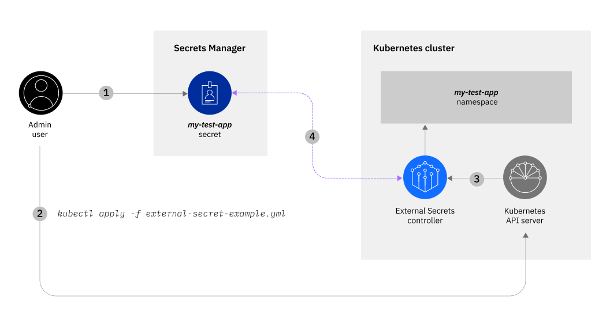

---


copyright:
  years: 2023
lastupdated: "2023-04-18"

keywords: tutorial, Secrets Manager

subcollection: secrets-manager
content-type: tutorial
services: secrets-manager,containers
account-plan: paid
completion-time: 45m

---

{:codeblock: .codeblock}
{:screen: .screen}
{:download: .download}
{:external: target="_blank" .external}
{:faq: data-hd-content-type='faq'}
{:gif: data-image-type='gif'}
{:important: .important}
{:note: .note}
{:pre: .pre}
{:tip: .tip}
{:preview: .preview}
{:deprecated: .deprecated}
{:beta: .beta}
{:term: .term}
{:shortdesc: .shortdesc}
{:script: data-hd-video='script'}
{:support: data-reuse='support'}
{:table: .aria-labeledby="caption"}
{:troubleshoot: data-hd-content-type='troubleshoot'}
{:help: data-hd-content-type='help'}
{:tsCauses: .tsCauses}
{:tsResolve: .tsResolve}
{:tsSymptoms: .tsSymptoms}
{:video: .video}
{:step: data-tutorial-type='step'}
{:tutorial: data-hd-content-type='tutorial'}
{:api: .ph data-hd-interface='api'}
{:cli: .ph data-hd-interface='cli'}
{:ui: .ph data-hd-interface='ui'}
{:terraform: .ph data-hd-interface="terraform"}
{:curl: .ph data-hd-programlang='curl'}
{:java: .ph data-hd-programlang='java'}
{:ruby: .ph data-hd-programlang='ruby'}
{:c#: .ph data-hd-programlang='c#'}
{:objectc: .ph data-hd-programlang='Objective C'}
{:python: .ph data-hd-programlang='python'}
{:javascript: .ph data-hd-programlang='javascript'}
{:php: .ph data-hd-programlang='PHP'}
{:swift: .ph data-hd-programlang='swift'}
{:curl: .ph data-hd-programlang='curl'}
{:dotnet-standard: .ph data-hd-programlang='dotnet-standard'}
{:go: .ph data-hd-programlang='go'}
{:unity: .ph data-hd-programlang='unity'}
{:release-note: data-hd-content-type='release-note'}


# Secure secrets for apps that run in your Kubernetes cluster
{: #tutorial-kubernetes-secrets}
{: toc-content-type="tutorial"}
{: toc-services="secrets-manager,containers"}
{: toc-completion-time="45m"}

In this tutorial, you learn how to use {{site.data.keyword.secrets-manager_full}} to manage secrets for applications that run your {{site.data.keyword.containerfull_notm}} cluster by using the [External Secrets Operator](https://external-secrets.io/latest/){: external} open-source tool. 

Alternatively, you can use the {{site.data.keyword.containershort}} CLI plug-in to manage TLS and non-TLS secrets. To learn more about this approach, see [Setting up Kubernetes Ingress](/docs/containers?topic=containers-ingress-types#non-tls).
{: note}


This tutorial is for the Classic flavor of {{site.data.keyword.containershort}} clusters. External Secrets is also available as an [OpenShift operator](https://operatorhub.io/operator/external-secrets-operator).
{: shortdesc}

You're a developer for a large organization, and your team is using {{site.data.keyword.containershort}} to deploy containerized apps and services on {{site.data.keyword.cloud_notm}}. In your current flow, you use [Kubernetes Secrets](https://kubernetes.io/docs/concepts/configuration/secret/){: external} to store the sensitive data, such as passwords and API keys, that are used by the apps and services that run in your cluster. To have more control over your application secrets, you want the ability to store your cluster secrets in an external secrets management service, where you can [encrypt them at rest](/docs/secrets-manager?topic=secrets-manager-mng-data), [monitor their activity](/docs/secrets-manager?topic=secrets-manager-at-events), and easily manage them.

With {{site.data.keyword.secrets-manager_short}}, you can centralize and secure the secrets that are used by the apps that run in your Kubernetes clusters. Rather than injecting your secrets at deployment time, you can configure your apps to securely retrieve secrets from {{site.data.keyword.secrets-manager_short}} at run time. When it's time to rotate the secret, you can do so from {{site.data.keyword.secrets-manager_short}}. For example, consider the following scenario:


{: caption="Figure 1. External Secrets flow" caption-side="bottom"}


1. As a developer, you use {{site.data.keyword.secrets-manager_short}} to store a secret for an application that you want to deploy in a Kubernetes cluster.
2. {{site.data.keyword.secrets-manager_short}} provides an ID for the secret. You include the ID in the `ExternalSecrets` configuration file for your app and you apply the configuration to the cluster.
3. The External Secrets controller fetches the `ExternalSecrets` objects in the configuration file that you defined by using the Kubernetes API. 
4. At application run time, the controller retrieves the secret data from {{site.data.keyword.secrets-manager_short}}, and converts the `ExternalSecrets` objects to Kubernetes secrets for your cluster.

This scenario features a third-party tool that can impact the compliance readiness of workloads that run in your Kubernetes cluster. If you add a community or third-party tool, keep in mind that you are responsible for maintaining the compliance of your apps, and working with the appropriate provider to troubleshoot any issues. For more information, see [Your responsibilities with using {{site.data.keyword.containerfull_notm}}](/docs/containers?topic=containers-responsibilities_iks).
{: note}

## Before you begin
{: #tutorial-kubernetes-secrets-prereqs}

Before you get started, be sure that you have [**Administrator** platform access](/docs/account?topic=account-assign-access-resources#assign-new-access) so that you can create account credentials and provision resources. You also need the following prerequisites:

- [Download and install the IBM Cloud CLI](https://cloud.ibm.com/docs/cli).
- [Install the {{site.data.keyword.secrets-manager_short}} CLI plug-in](/docs/secrets-manager?topic=secrets-manager-cli-plugin-secrets-manager-cli).
- [Install the Kubernetes CLI (`kubectl`)](https://kubernetes.io/docs/tasks/tools/){: external}.
- [Download and install jq](https://stedolan.github.io/jq/){: external}.

    `jq` helps you slice and filter JSON data. You use `jq` in this tutorial to grab and use stored environment variables.


## Set up your environment
{: #tutorial-kubernetes-secrets-set-up-env}
{: step}

To work with {{site.data.keyword.secrets-manager_short}} and {{site.data.keyword.containershort}}, you need to create a cluster and a {{site.data.keyword.secrets-manager_short}} instance in your {{site.data.keyword.cloud_notm}} account. You also need to configure permissions so that you can run operations against both services.

In this step, you set up an access environment by creating a service ID and an {{site.data.keyword.cloud_notm}} API key. At the end of the tutorial, you can easily remove your resources if you no longer need them. Alternatively, you can use a [trusted profile](#tutorial-kubernetes-secrets-trusted-profile) to authorize the External Secrets operator.


### Create a service ID and API key
{: #tutorial-external-kubernetes-secrets-access}

Start by creating the account credentials that you need to be able to run operations against {{site.data.keyword.secrets-manager_short}} and {{site.data.keyword.containershort}}.

1. From the command line, log in to {{site.data.keyword.cloud_notm}} through the [{{site.data.keyword.cloud_notm}} CLI](/docs/cli?topic=cli-install-ibmcloud-cli).

    ```sh
    ibmcloud login
    ```
    {: pre}

    If the login fails, run the `ibmcloud login --sso` command to try again. The `--sso` parameter is required when you log in with a federated ID. If this option is used, go to the link listed in the CLI output to generate a one-time passcode.
    {: note}

2. Create a service ID and set it as an environment variable.

    ```sh
    export SERVICE_ID=`ibmcloud iam service-id-create kubernetes-secrets-tutorial --description "A service ID for testing Secrets Manager and Kubernetes Service." --output json | jq -r ".id"`; echo $SERVICE_ID
    ```
    {: pre}

3. Assign the service ID permissions to read secrets from {{site.data.keyword.secrets-manager_short}}.

    ```sh
    ibmcloud iam service-policy-create $SERVICE_ID --roles "SecretsReader" --service-name secrets-manager
    ```
    {: pre}

    By assigning **SecretsReader** service access, the External Secrets controller has the correct level of access to read secrets from {{site.data.keyword.secrets-manager_short}} and populate them in a Kubernetes cluster.


4. Create an {{site.data.keyword.cloud_notm}} API key for your service ID.

    ```sh
    export IBM_CLOUD_API_KEY=`ibmcloud iam service-api-key-create kubernetes-secrets-tutorial $SERVICE_ID --description "An API key for testing Secrets Manager." --output json | jq -r ".apikey"`
    ```
    {: pre}

    You use this API key later to configure {{site.data.keyword.secrets-manager_short}} for your cluster deployment.


### Create a Kubernetes cluster and {{site.data.keyword.secrets-manager_short}} instance
{: #tutorial-kubernetes-secrets-prepare-cluster}

Create a Kubernetes cluster and an instance of {{site.data.keyword.secrets-manager_short}} in your {{site.data.keyword.cloud_notm}} account.

You can create one free Kubernetes cluster and {{site.data.keyword.secrets-manager_short}} service instance per {{site.data.keyword.cloud_notm}} account. If you already have both resources in your account, you can use your existing free cluster and {{site.data.keyword.secrets-manager_short}} instance to complete the tutorial.
{: note}

1. From the command line, select the account, region, and resource group where you want to create a {{site.data.keyword.secrets-manager_short}} service instance.

    In this tutorial, you interact with the Dallas region. If you're logged in to a different region, be sure to set Dallas as your target region by running the following command.

    ```sh
    ibmcloud target -r us-south -g default
    ```
    {: pre}

2. Create a Kubernetes cluster.

    ```sh
    ibmcloud ks cluster create classic --zone dal10 --flavor free --name my-test-cluster
    ```
    {: pre}

3. Create a {{site.data.keyword.secrets-manager_short}} instance.

    ```sh
    ibmcloud resource service-instance-create my-secrets-manager secrets-manager trial us-south
    ```
    {: pre}

    Provisioning for both {{site.data.keyword.secrets-manager_short}} and your Kubernetes cluster takes 5 - 15 minutes to complete.

4. Before you continue to the next step, verify that your cluster and {{site.data.keyword.secrets-manager_short}} instance are provisioned successfully.

    1. Verify that the deployment of your worker node is complete.

        ```sh
        ibmcloud ks worker ls --cluster my-test-cluster
        ```
        {: pre}

        When your worker node is finished provisioning, the status changes to **Ready**.

        ```sh
        ID                                                       Public IP       Private IP      Flavor   State          Status                Zone    Version
        kube-c39pf4ld0m87o3fv1utg-mytestclust-default-000000dd   169.xx.xx.xxx   10.xxx.xx.xxx   free     normal   Ready   mex01   1.20.7_1543
        ```
        {: screen}

    2. Next, verify that your {{site.data.keyword.secrets-manager_short}} instance provisioned successfully.

        ```sh
        ibmcloud resource service-instance my-secrets-manager
        ```
        {: pre}

        When the instance is finished provisioning, the state changes to **Active**.

        ```plaintext
        Name:                  my-secrets-manager
        ID:                    crn:v1:bluemix:public:secrets-manager:us-south:a/f047b55a3362ac06afad8a3f2f5586ea:fe06948b-0c6b-4183-8d4b-e6c1d38ff65f::
        GUID:                  fe06948b-0c6b-4183-8d4b-e6c1d38ff65f
        Location:              us-south
        Service Name:          secrets-manager
        Service Plan Name:     trial
        Resource Group Name:   default
        State:                 active
        Type:                  service_instance
        Sub Type:
        Created at:            2021-01-06T17:11:32Z
        Created by:            zara@example.com
        Updated at:            2021-03-31T02:33:26Z
        ```
        {: screen}

5. Set the context for your Kubernetes cluster in the CLI.

    ```sh
    ibmcloud ks cluster config --cluster my-test-cluster
    ```
    {: pre}

6. Verify that `kubectl` commands run properly and that the Kubernetes context is set to your cluster.

    ```sh
    kubectl config current-context
    ```
    {: pre}

    Example output:

    ```sh
    my-test-cluster/<your_cluster_ID>
    ```
    {: screen}

### Create a trusted profile
{: #tutorial-kubernetes-secrets-trusted-profile}

A trusted profile enables the External Secrets operator to read from {{site.data.keyword.secrets-manager_short}}, without having to create a service ID or manage an API key.

1. Get the CRNs for your {{site.data.keyword.secrets-manager_short}} instance and Kubernetes cluster.

    ```sh
    CLUSTER_CRN=$(ibmcloud ks cluster get --cluster my-test-cluster --output json | jq -r '.crn')
    SECRETS_MANAGER_CRN=$(ibmcloud resource service-instance my-secrets-manager --output JSON | jq -r '.[0].crn')
    ```
    {: pre}

2. Create the profile.

    ```sh
    ibmcloud iam trusted-profile-create 'External Secrets'
    ```
    {: pre}

3. Authorize the Kubernetes cluster to use the trusted profile.

    ```sh
    ibmcloud iam trusted-profile-rule-create 'External Secrets' --name kubernetes --type Profile-CR --conditions claim:namespace,operator:EQUALS,value:external-secrets --conditions claim:name,operator:EQUALS,value:external-secrets --conditions claim:crn,operator:EQUALS,value:$CLUSTER_CRN --cr-type IKS_SA
    ```
    {: pre}

4. Create an access policy that allows the trusted profile to read secrets from your {{site.data.keyword.secrets-manager_short}} instance.

    ```sh
    ibmcloud iam trusted-profile-policy-create 'External Secrets' --roles SecretsReader --service-instance $SECRETS_MANAGER_CRN --service-name secrets-manager
    ```
    {: pre}

### Prepare your {{site.data.keyword.secrets-manager_short}} instance
{: #tutorial-kubernetes-secrets-prepare-sm}

Finally, configure your {{site.data.keyword.secrets-manager_short}} instance to start working with secrets.

1. From the command line, verify that you can access the {{site.data.keyword.secrets-manager_short}} CLI plug-in.

    ```sh
    ibmcloud secrets-manager --help
    ```
    {: pre}

    Don't have the plug-in yet? To install the {{site.data.keyword.secrets-manager_short}} CLI plug-in, run `ibmcloud plugin install secrets-manager`.
    {: tip}

2. Export an environment variable with your unique {{site.data.keyword.secrets-manager_short}} API endpoint URL.

    ```sh
    export SECRETS_MANAGER_URL=`ibmcloud resource service-instance my-secrets-manager --output json | jq -r '.[].dashboard_url | .[0:-3]'`; echo $SECRETS_MANAGER_URL
    ```
    {: pre}

3. Create a secret group for your instance.

    [Secret groups](/docs/secrets-manager?topic=secrets-manager-secret-groups) are a way to organize and control who on your team has access to specific secrets in your instance. To create a secret group from the {{site.data.keyword.cloud_notm}} CLI, you use the [**`ibmcloud secrets-manager secret-group-create`**](/docs/secrets-manager?topic=secrets-manager-cli-plugin-secrets-manager-cli#secrets-manager-cli-secret-group-create-command) command. Run the following command to create a secret group and store its ID as an environment variable.

    ```sh
    export SECRET_GROUP_ID=`ibmcloud secrets-manager secret-group-create --resources '[{"name":"my-test-secret-group","description":"Read and write to my test app."}]' --output json | jq -r ".resources[].id"`; echo $SECRET_GROUP_ID
    ```
    {: pre}

    Using a Windows™ command prompt (`cmd.exe`) or PowerShell? If you encounter errors with passing JSON content on the command line, you might need to adjust the strings for quotation-escaping requirements that are specific to your operating system. For more information, see [Using quotation marks with strings in the {{site.data.keyword.cloud_notm}} CLI](/docs/cli?topic=cli-quote-strings).
    {: tip}

    Success! Now you can store the secret in {{site.data.keyword.secrets-manager_short}} that you want to populate in your Kubernetes cluster. Continue to the next step.


## Create a secret in {{site.data.keyword.secrets-manager_short}}
{: #tutorial-kubernetes-secrets-create-secret}
{: step}

Secrets are application-specific and can vary based on the individual app or service that requires them. A secret might consist of a username, password, API key, or any other type of credential.

{{site.data.keyword.secrets-manager_short}} supports various [types of secrets](/docs/secrets-manager?topic=secrets-manager-what-is-secret#secret-types) that you can create and manage in the service. For example, if you need to manage an API key for an app that is protected by {{site.data.keyword.cloud_notm}} IAM authentication, you can create an [IAM credential](/docs/secrets-manager?topic=secrets-manager-iam-credentials). Or, if you need to manage a secret that can hold any type of structured or unstructured data, you can create an [arbitrary secret](/docs/secrets-manager?topic=secrets-manager-arbitrary-secrets).

In this tutorial, you create a username and password as an example. To create a secret from the {{site.data.keyword.cloud_notm}} CLI, you use the [**`ibmcloud secrets-manager secret-create`**](/docs/secrets-manager?topic=secrets-manager-cli-plugin-secrets-manager-cli#secrets-manager-cli-secret-create-command) command. Run the following command to create the secret and store its ID as an environment variable.

```sh
export SECRET_ID=`ibmcloud secrets-manager secret-create --secret-type username_password  --resources '[{"name":"example_username_password","description":"Extended description for my secret.","secret_group_id":"'"$SECRET_GROUP_ID"'","username":"user123","password":"cloudy-rainy-coffee-book","labels":["my-test-cluster","tutorial"]}]' --output json | jq -r ".resources[].id"`; echo $SECRET_ID
```
{: pre}

The output shows the ID of your newly created secret. For example:

```plaintext
e0246cea-d668-aba7-eef2-58ca11ad3707
```
{: screen}


## Set up External Secrets Operator
{: #tutorial-kubernetes-secrets-configure-external}
{: step}

Now that you have a secret for your application, you can set up the [External Secrets Operator](https://external-secrets.io/latest/){: external} tool for your cluster. This package configures the connection between {{site.data.keyword.secrets-manager_short}} and your cluster by creating `ExternalSecrets` objects that are converted to Kubernetes secrets for your application.

External Secrets Operator is an open source tool that is not maintained by IBM. For more information about this tool or to troubleshoot any issues, refer to the [project documentation](https://external-secrets.io/latest/){: external}.
{: note}

### Configure External Secrets Operator for your cluster
{: #tutorial-kubernetes-secrets-configure-app}

First, add `external-secrets` resources to your cluster by installing the official Helm chart. For more installation options, check out the [getting started guide](https://external-secrets.io/v0.5.9/guides-getting-started/){: external}.

1. From your command line, use the service ID API key that you created in step 1 to define `secret-api-key`.

    ```sh
    kubectl -n default create secret generic secret-api-key --from-literal=apikey=$IBM_CLOUD_API_KEY
    ```
    {: pre}

2. Run the following commands to install External Secrets Operator.

    ```sh
    helm repo add external-secrets https://charts.external-secrets.io
    ```
    {: pre}

    If you're using a service ID to authenticate:

    ```sh
    helm install external-secrets external-secrets/external-secrets -n external-secrets --create-namespace --set installCRDs=true
    ```
    {: pre}

    If you're using a trusted profile to authenticate:

    ```sh
    echo '
    [root@vpc-bastion-6miaq40s-jumphost secret_testing]# cat values.yml
    installCRDs: true
    extraVolumes:
    - name: sa-token
    projected:
        defaultMode: 420
        sources:
        - serviceAccountToken:
            path: sa-token
            expirationSeconds: 3600
            audience: iam
    extraVolumeMounts:
    - mountPath: /var/run/secrets/tokens
    name: sa-token
    webhook:
    extraVolumes:
    - name: sa-token
    projected:
        defaultMode: 420
        sources:
        - serviceAccountToken:
            path: sa-token
            expirationSeconds: 3600
            audience: iam
    extraVolumeMounts:
    - mountPath: /var/run/secrets/tokens
    name: sa-token
    ```
    {: pre}


### Update your app configuration 
{: #tutorial-kubernetes-secrets-update-deployment}

After you install External Secrets Operator in your cluster, you can define {{site.data.keyword.secrets-manager_short}} as the secrets backend for your application. Start by creating a configuration file that targets the secret in {{site.data.keyword.secrets-manager_short}} that you want to use.

1. In the root directory of your application, create an `external-secrets-example.yml` file.

    ```sh
    touch external-secrets-example.yml
    ```
    {: pre}

2. Modify the file to include information about the secret that you want to fetch from your {{site.data.keyword.secrets-manager_short}} instance.

    ```yaml 
    apiVersion: external-secrets.io/v2beta2
    kind: SecretStore
    metadata:
      name: ibmcloud-secrets-manager-example
    spec:
      provider:
        ibm:
          serviceUrl: <endpoint_url>
          auth:
            secretRef:
              secretApiKeySecretRef:
                name: secret-api-key
                key: apikey
                
    apiVersion: external-secrets.io/v1beta1
    kind: ExternalSecret
    metadata:
      name: ibmcloud-secrets-manager-example
    spec:
      secretStoreRef:
        name: ibmcloud-secrets-manager-example
        kind: SecretStore
      target:
        name: ibmcloud-secrets-manager-example
      data:
      - secretKey: username
        remoteRef:
          property: username
          key: username_password/<SECRET_ID>
      - secretKey: password
        remoteRef:
          property: password
          key: username_password/<SECRET_ID>
    ```
    {: codeblock}

    Replace `<endpoint_url>` with the {{site.data.keyword.secrets-manager_short}} endpoint URL that you retrieved [earlier](#tutorial-kubernetes-secrets-prepare-sm). Replace `<SECRET_ID>` with the unique ID of the secret that you created in the previous step.

    If you're using a trusted profile to authenticate, replace the `auth` block with the following snippet.
    ```yaml
          auth:
            containerAuth:
              profile: "External Secrets"
              iamEndpoint: https://iam.cloud.ibm.com
              tokenLocation: /var/run/secrets/tokens/sa-token
    ```
    {: codeblock}

3. Apply the configuration to your cluster.

    ```sh
    kubectl apply -f external-secrets-example.yml
    ```
    {: pre}

4. Verify that the External Secrets Operator is able to fetch the secret that is stored in your {{site.data.keyword.secrets-manager_short}} instance.

    ```sh
    kubectl get secret ibmcloud-secrets-manager-example -o json | jq '.data | map_values(@base64d)'
    ```
    {: pre}

    Example output:

    ```json
    {
        "password": "cloudy-rainy-coffee-book",
        "username": "user123"
    }
    ```
    {: screen}

    Success! You're now able to fetch the secret data that is stored in your {{site.data.keyword.secrets-manager_short}} instance. Continue to the next step.

## Deploy an app to the cluster
{: #tutorial-kubernetes-secrets-deploy-app}
{: step}


Finally, you can deploy an application in your cluster that uses the {{site.data.keyword.secrets-manager_short}} secret that you defined in the `external-secret-example.yml` file. At application run time, the secret data that is fetched from {{site.data.keyword.secrets-manager_short}} is converted to a Kubernetes secret that can be used by your cluster.

Looking for examples on how to deploy an app? Check out [Deploying Kubernetes-native apps in clusters](/docs/containers?topic=containers-deploy_app) to find out more about deploying a single instance of an app.


## (Optional) Clean up resources
{: #tutorial-kubernetes-secrets-clean-up}
{: step}

If you no longer need the resources that you created in this tutorial, you can complete the following steps to remove them from your account.

1. Delete your test Kubernetes cluster.

    ```sh
    ibmcloud ks cluster rm --cluster my-test-cluster
    ```
    {: pre}

2. Delete your test {{site.data.keyword.secrets-manager_short}} instance.

    ```sh
    ibmcloud resource service-instance-delete my-secrets-manager
    ```
    {: pre}

3. Delete your authorization.

    If you're using a service ID.

    ```sh
    ibmcloud iam service-id-delete $SERVICE_ID
    ```
    {: pre}

    If you're working with a trusted profile.

    ```sh
    ibmcloud iam trusted-profile-delete 'External Secrets'
    ```
    {: pre}

## Best practices for using External Secrets Operator with {{site.data.keyword.secrets-manager_short}} 
{: #kubernetes-secrets-best-practices}

{{site.data.keyword.secrets-manager_short}} sets a limit on the rate in which a client can send API requests to it. The limit is 20 calls per second for all API methods.

As you construct your [YAML document](#tutorial-kubernetes-secrets-update-deployment), keep in mind that each key in the data section is polled periodically by using REST from the {{site.data.keyword.secrets-manager_short}} instance. Be aware that:

1. By default, the polling interval is set to 1 hour. For best results with {{site.data.keyword.secrets-manager_short}}, the polling interval must be greater than 1000 * number of Kubernetes secrets. You can set this value by using `spec.refreshInterval` in the External Secrets template. 
2. If you set the YAML to fetch a {{site.data.keyword.secrets-manager_short}} secret by name rather than ID (`keyByName: true`), each data entry generates two API calls rather than one. Be extra careful with the number of data entries in the YAML configuration file if you select this option. For more information, see the [External Secrets documentation](https://external-secrets.io/latest/){: external}.


## Next steps
{: #kubernetes-secrets-next-steps}

Great job! In this tutorial, you learned how to set up {{site.data.keyword.secrets-manager_short}} to securely populate application secrets to your cluster. Check out more resources to help you get started with {{site.data.keyword.secrets-manager_short}}.

- Review the [secret types in {{site.data.keyword.secrets-manager_short}}](https://external-secrets.io/latest/provider/ibm-secrets-manager/){: external} that are supported by External Secrets Operator.
- Learn more about the [{{site.data.keyword.secrets-manager_short}} API](/apidocs/secrets-manager).
