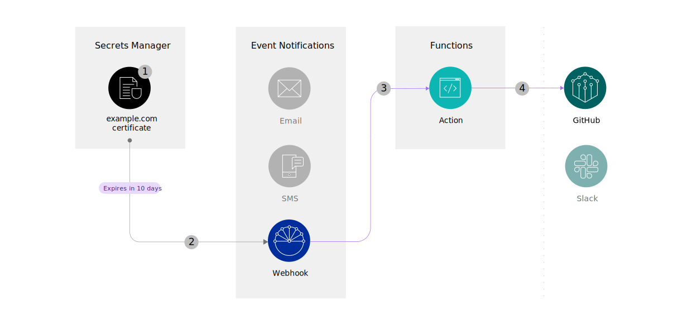

---
copyright:
  years: 2022
lastupdated: "2022-05-19"

keywords: create GitHub issue, open GitHub issue, send to GitHub, expiring secrets, expiring certificates

subcollection: secrets-manager
content-type: tutorial
services: secrets-manager,openwhisk,event-notifications
account-plan: paid
completion-time: 15m

---

{:codeblock: .codeblock}
{:screen: .screen}
{:download: .download}
{:external: target="_blank" .external}
{:faq: data-hd-content-type='faq'}
{:gif: data-image-type='gif'}
{:important: .important}
{:note: .note}
{:pre: .pre}
{:tip: .tip}
{:preview: .preview}
{:deprecated: .deprecated}
{:beta: .beta}
{:term: .term}
{:shortdesc: .shortdesc}
{:script: data-hd-video='script'}
{:support: data-reuse='support'}
{:table: .aria-labeledby="caption"}
{:troubleshoot: data-hd-content-type='troubleshoot'}
{:help: data-hd-content-type='help'}
{:tsCauses: .tsCauses}
{:tsResolve: .tsResolve}
{:tsSymptoms: .tsSymptoms}
{:video: .video}
{:step: data-tutorial-type='step'}
{:tutorial: data-hd-content-type='tutorial'}
{:api: .ph data-hd-interface='api'}
{:cli: .ph data-hd-interface='cli'}
{:ui: .ph data-hd-interface='ui'}
{:curl: .ph data-hd-programlang='curl'}
{:java: .ph data-hd-programlang='java'}
{:ruby: .ph data-hd-programlang='ruby'}
{:c#: .ph data-hd-programlang='c#'}
{:objectc: .ph data-hd-programlang='Objective C'}
{:python: .ph data-hd-programlang='python'}
{:javascript: .ph data-hd-programlang='javascript'}
{:php: .ph data-hd-programlang='PHP'}
{:swift: .ph data-hd-programlang='swift'}
{:curl: .ph data-hd-programlang='curl'}
{:dotnet-standard: .ph data-hd-programlang='dotnet-standard'}
{:go: .ph data-hd-programlang='go'}
{:unity: .ph data-hd-programlang='unity'}
{:release-note: data-hd-content-type='release-note'}


# Part 2: Create a GitHub issue when your certificates are about to expire
{: #tutorial-expiring-secrets-part-2}
{: toc-content-type="tutorial"}
{: toc-services="secrets-manager,openwhisk,event-notifications"}
{: toc-completion-time="15m"}

This tutorial is part 2 of a 3-part tutorial series that guides you through setting up alerts for your expiring secrets.
{: shortdesc}

In part 1 of this tutorial series, you learned how to set up {{site.data.keyword.secrets-manager_full}} and {{site.data.keyword.en_short}} to route events to a test webhook URL. Part 2 shows you how to replace your test webhook with a Cloud Functions webhook URL so that you can open a GitHub issue that contains your {{site.data.keyword.secrets-manager_short}} notification content.

{: caption="Figure 1. Notifications flow" caption-side="bottom"}

## Before you begin
{: #tutorial-expiring-secrets-part-2-prereqs}

Be sure that you've completed [Part 1: Enabling notifications for {{site.data.keyword.secrets-manager_short}}](/docs/secrets-manager?topic=secrets-manager-tutorial-expiring-secrets-part-1). Before you get started with part 2, you also need the following prerequisites:

- An {{site.data.keyword.cloud_notm}} API key with **Manager** service access on the {{site.data.keyword.en_short}} service.
- A [GitHub personal access token](https://docs.github.com/en/authentication/keeping-your-account-and-data-secure/creating-a-personal-access-token){: external} with **repo** access.

## Create a webhook with Cloud Functions
{: #tutorial-expiring-secrets-part-2-create-webhook}
{: step}

Let's start by creating a [Cloud Functions](/docs/openwhisk) action. A Cloud Functions action is a piece of code that can be run in response to a trigger, such as an incoming notification from the {{site.data.keyword.en_short}} service. Your Cloud Functions action can contain code that takes an incoming payload from {{site.data.keyword.en_short}}, which originated as an event in {{site.data.keyword.secrets-manager_short}}, and uses it to create a GitHub issue.

### Create a Cloud Functions action
{: #tutorial-expiring-secrets-part-2-create-function}

To create a Cloud Functions action, you can use the Functions UI.

1. In the {{site.data.keyword.cloud_notm}} console, click the **Menu** icon  **> Functions**.
2. In the navigation, click **Actions > Create**.
3. Give the action a name. For example, _sm-notifications-github_.
4. Choose the default package.
5. Select a Node.js runtime.
6. Click **Create**.

### Obtain your new webhook URL
{: #tutorial-expiring-secrets-part-2-get-webhook}

In part 1 of this tutorial series, you used [Webhook.site](https://webhook.site){: external} to test your notifications workflow for the first time. Now that you've set up a Cloud Functions action, you can also use it to receive any incoming notifications.

1. From the Cloud Functions action menu, click **Endpoints**.
2. Select **Enable as Web Action**.
3. Select **Raw HTTP handling**.
3. Click **Save**.
4. Copy the URL. This URL will be your new webhook URL that you can add as an {{site.data.keyword.en_short}} destination in the next step.

## Update your {{site.data.keyword.en_short}} settings
{: #tutorial-expiring-secrets-part-2-update-en}
{: step}

Next, update your {{site.data.keyword.en_short}} settings so that the service can begin to forward any incoming events from {{site.data.keyword.secrets-manager_short}} to your new Cloud Functions action.

### Add your new webhook URL as a destination
{: #tutorial-expiring-secrets-part-2-destination}

Start by adding your Cloud Functions webhook URL as a new {{site.data.keyword.en_short}} destination.

1. In the console, click the **Menu** icon  **> Resource list**.
2. From the list of resources, select your {{site.data.keyword.en_short}} instance.
3. In the {{site.data.keyword.en_short}} UI, go to **Destinations**.
4. [Create a destination](/docs/event-notifications?topic=event-notifications-en-create-en-destination) so that your alerts can be forwarded to the Cloud Functions webhook that you created the previous step.
   1. From the navigation, click **Destinations > Add**.
   2. Provide a name for your destination. For example, _GitHub_.
   3. Select **Webhook** as the destination type.
   4. Paste the URL that you copied from the Cloud Functions UI.
   5. From the list of HTTP verbs, select **POST**.
   6. Click **Add**.

   After you create your destination, copy your destination ID. You use this value to prepare your Functions code in a later step.
   {: tip}

### Enable webhook signing
{: #tutorial-expiring-secrets-part-2-enable-signing}

By default, the notification content that is delivered to a webhook URL arrives in raw JSON format. {{site.data.keyword.en_short}} can optionally send notifications as signed JSON Web Tokens (JWT). In this step, you enable signing for the webhook subscription that you created in part 1.

With webhook signing, you verify that the notification payload is sent by {{site.data.keyword.en_short}} and not by a third party. For more information, check out the [{{site.data.keyword.en_short}} documentation](/docs/event-notifications?topic=event-notifications-en-destinations-webhook#en-webhook-sign).
{: tip}

1. [Create a subscription with signing enabled](/docs/event-notifications?topic=event-notifications-en-create-en-subscription) between your existing {{site.data.keyword.secrets-manager_short}} topic and your new Cloud Functions destination.
   1. In the {{site.data.keyword.en_short}} UI, click **Subscriptions > Create**.
   2. Provide a name for your subscription. For example, _GitHub_.
   3. Select the {{site.data.keyword.secrets-manager_short}} topic that you created in part 1.
   4. Select the destination that you created in the previous step.
   5. In the Security section, select the **Signing enabled** option.
   6. Click **Create**.
2. Update your existing subscription (between your {{site.data.keyword.secrets-manager_short}} topic and [Webhook.site](https://webhook.site){: external} URL) to enable signing.
   1. In the row for subscription that you created in part 1, click the **Actions** menu  **> Edit**.
   2. In the Security section, select the **Signing enabled** option.
   3. Click **Save**.

   Now you're all set to securely deliver notifications to your webhook URL. Continue to the next step.

### Verify the notification payload
{: #tutorial-expiring-secrets-part-2-jwt}

Next, test that your notifications are now delivered as a signed JWT objects to your [Webhook.site](https://webhook.site){: external} page. You can use the **Settings > Event Notifications** section in the {{site.data.keyword.secrets-manager_short}} UI to [send a test event](/docs/secrets-manager?topic=secrets-manager-event-notifications#event-notifications-test-ui). The output of a signed notification payload looks similar to the following example.

```json
{
  "data": "eyJhbGciOiJSUzI1NiIsInR5cCI6IkpXVCJ9.eyJkYXQiOnsiYXV0aG9yIjp7...(truncated)"
}
```
{: screen}

To verify the signature and decrypt the message, you'll need to obtain the public key that is generated by {{site.data.keyword.en_short}}. Continue to the next step.

## Prepare your sample code
{: #tutorial-expiring-secrets-part-2-prepare}
{: step}

Next, prepare the sample code for your Cloud Functions action.

1. Copy the following JavaScript code and update the placeholder values.

   ```javascript
   const axios = require('axios');
   const jwtVerify = require('jsonwebtoken').verify;

   // Generate an IAM token
   async function getIAMToken() {
      const options = {
         url: 'https://iam.cloud.ibm.com/identity/token',
         method: 'POST',
         header: 'Content-Type: application/x-www-form-urlencoded',
         data: 'grant_type=urn:ibm:params:oauth:grant-type:apikey&apikey=API_KEY'
      };

      const response = await axios(options);
      const responseData = response.data;
      console.log("\nGenerated an IAM token..");
      return responseData.access_token;
   }

   // Get a public key to verify notifications
   async function getPublicKey() {
      const accessToken = await getIAMToken();

      const options = {
         method: 'GET',
         url: '<event_notifications_endpoint_url>/destinations/<destination_id>/public_key',
         headers: {
               'authorization': 'Bearer ' + accessToken
         }
      };

      const response = await axios(options);
      const responseData = response.data;
      console.log('\nRetrieved a public key from Event Notifications..');
      return responseData.public_key;
   }

   function getDate(timestamp) {
      return new Date(timestamp).toDateString();
   }

   // Build a GitHub issue description according to the event type
   function createIssueBody(notificationData) {
      if (notificationData.event_type === "test_event") // Remove this option later if you don't want to create issues for test events
         return `This is a test notification from ${notificationData.source_service}.`; 
      if (notificationData.event_type === "secret_about_to_expire")
         return `The following certificate(s) expire on ${getDate(notificationData.secrets_expiration_date)}:
      ${notificationData.secrets.reduce((accumulator, currentValue) => {
               return accumulator + `
      > Domain(s): ${currentValue.domains}
      Secret ID: ${currentValue.secret_id}
      Secret name: ${currentValue.secret_name}
      `;
         }, "")}`;
      if (notificationData.event_type === "secret_expired")
         return `The following certificate(s) have expired:
      ${notificationData.secrets.reduce((accumulator, currentValue) => {
               return accumulator + `
      > Domain(s): ${currentValue.domains}
      Secret ID: ${currentValue.secret_id}
      Secret name: ${currentValue.secret_name}
      `;
         }, "")}`;
   }

   async function main(params) {
      try {
         const publicKey = await getPublicKey();

         // Verify the notification data using the retrieved public key
         const decodedNotification = await jwtVerify(params.__ow_body, publicKey).data.data;
         console.log(`\nReceived the following event notification from Secrets Manager:\n${JSON.stringify(decodedNotification)}`);

         const body = createIssueBody(decodedNotification);
         if (!body) {
               console.log(`\nNo action required for this notification. Event type: ${decodedNotification.event_type}`);
               return;
         }

         // Create a GitHub issue with notification data
         const options = {
               method: 'POST',
               url: 'https://api.github.com/repos/<org_name>/<repo_name>/issues',
               headers: {
                  accept: 'application/vnd.github.v3+json',
                  authorization: '<github_token>'
               },
               data: {
                  title: 'Test issue',
                  body: body,
                  labels: ['<label>', '<label>'],
                  assignees: ['<assignee>']
               }
         };

         await axios(options);
         console.log('\nNotification successfully forwarded to GitHub!');

      } catch (error) {
         console.error(error);
      }
   }
   ```
   {: codeblock}

   | Variable | Description |
   | ---- | ---- |
   | `API_KEY` | An {{site.data.keyword.cloud_notm}} API key with **Manager** access on the {{site.data.keyword.en_short}} service. |
   | `<event_notifications_endpoint_url>` | The base URL of your {{site.data.keyword.en_short}} service instance. For more information, see the [{{site.data.keyword.en_short}} API documentation](/apidocs/event-notifications/event-notifications#event-notifications-endpoint-url).|
   | `<destination_id>` | The ID of the {{site.data.keyword.en_short}} destination that you created in [step 2](#tutorial-expiring-secrets-part-2-destination). |
   | `<github_org>`  \n`<github_repo>` | The values that are associated with the GitHub repository where you would like to open issues. Replace `<owner>` and `<repo>` with the values that apply to repository. |
   | `<github_token>` | Your GitHub personal access token, prefixed by the word _Token_. For example, `Token 35890433325cv...(truncated)`. |
   {: caption="Table 1. Variables to replace in your Functions code" caption-side="top"}

2. Paste the code into your Functions action.
   1. In the console, go **Menu** icon  **> Functions > Actions** to return to the Functions UI.
   2. From your list of actions, select the action that you created in step 1.
   3. Paste the code that you modified.
   4. Click **Save**.

## Test your connection to GitHub
{: #tutorial-expiring-secrets-part-2-test} 
{: step}

Finally, verify that you're able to post your notifications to GitHub. You can use the **Settings > Event Notifications** section in the {{site.data.keyword.secrets-manager_short}} UI to send a test event. Then, check your GitHub repository to view the results.

{: caption="Figure 2. Sending a test event to {{site.data.keyword.en_short}}" caption-side="bottom"}

1. In the {{site.data.keyword.cloud_notm}} console, go to your {{site.data.keyword.secrets-manager_short}} instance.
2. Go to **Settings > Event Notifications**, and click **Send test event**.
3. Check the GitHub repository that you defined in the Functions action to verify the results.

   If the Functions action completed successfully, you see a GitHub issue created that is similar to the following example:

   ```text
   Test issue
  
   This is a test notification from SecretsManager.
   ```
   {: screen}

   If you have an existing certificate in your {{site.data.keyword.secrets-manager_short}} instance that expires soon, a GitHub issue is created similar to the following example:

   ```text
   Test issue

   The following certificate(s) expire on Thu Mar 10 2022:

   Domain(s): example.com
   Secret ID: 538f7d7e-bef8-2b9a-704f-f4a897219df6
   Secret name: example-certificate
   ```
   {: screen}

4. Optional. Check your Cloud Functions activations logs if you encounter issues.

   From the [Cloud Functions activations dashboard](/functions/dashboard){: external}, you can check to see your activated action. _Notification successfully forwarded to Slack!_ is displayed in the response details if the code runs successfully.

   If you see HTTP `4XX` errors in the logs, make sure that the API key in your action code has the correct level of access. For JWT signature errors, verify that the {{site.data.keyword.en_short}} destination ID in the action code corresponds with your Cloud Functions webhook.
   {: tip}

## Next steps
{: #tutorial-expiring-secrets-part-2-next-steps}

Great job! In part 2 of this tutorial series, you learned how to set up a Cloud Functions action that takes your incoming notification content and uses it to open an issue in your GitHub repository. From now on, a GitHub issue is created each time that a certificate in your {{site.data.keyword.secrets-manager_short}} service instance expires or is about to expire. In part 3, you create another Functions action that sends your notifications to Slack.

- [Part 3: Send your notifications to a Slack channel](/docs/secrets-manager?topic=secrets-manager-tutorial-expiring-secrets-part-3)


