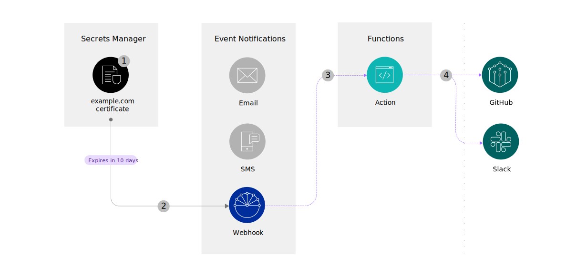

---
copyright:
  years: 2022
lastupdated: "2022-03-15"

keywords: set up alerts, set up notifications, expiring secrets, expiring certificates

subcollection: secrets-manager
content-type: tutorial
services: secrets-manager,openwhisk,event-notifications
account-plan: lite
completion-time: 10m

---

{:codeblock: .codeblock}
{:screen: .screen}
{:download: .download}
{:external: target="_blank" .external}
{:faq: data-hd-content-type='faq'}
{:gif: data-image-type='gif'}
{:important: .important}
{:note: .note}
{:pre: .pre}
{:tip: .tip}
{:preview: .preview}
{:deprecated: .deprecated}
{:beta: .beta}
{:term: .term}
{:shortdesc: .shortdesc}
{:script: data-hd-video='script'}
{:support: data-reuse='support'}
{:table: .aria-labeledby="caption"}
{:troubleshoot: data-hd-content-type='troubleshoot'}
{:help: data-hd-content-type='help'}
{:tsCauses: .tsCauses}
{:tsResolve: .tsResolve}
{:tsSymptoms: .tsSymptoms}
{:video: .video}
{:step: data-tutorial-type='step'}
{:tutorial: data-hd-content-type='tutorial'}
{:api: .ph data-hd-interface='api'}
{:cli: .ph data-hd-interface='cli'}
{:ui: .ph data-hd-interface='ui'}
{:curl: .ph data-hd-programlang='curl'}
{:java: .ph data-hd-programlang='java'}
{:ruby: .ph data-hd-programlang='ruby'}
{:c#: .ph data-hd-programlang='c#'}
{:objectc: .ph data-hd-programlang='Objective C'}
{:python: .ph data-hd-programlang='python'}
{:javascript: .ph data-hd-programlang='javascript'}
{:php: .ph data-hd-programlang='PHP'}
{:swift: .ph data-hd-programlang='swift'}
{:curl: .ph data-hd-programlang='curl'}
{:dotnet-standard: .ph data-hd-programlang='dotnet-standard'}
{:go: .ph data-hd-programlang='go'}
{:unity: .ph data-hd-programlang='unity'}
{:release-note: data-hd-content-type='release-note'}


# Part 1: Enable notifications for {{site.data.keyword.secrets-manager_short}}
{: #tutorial-expiring-secrets-part-1}
{: toc-content-type="tutorial"}
{: toc-services="secrets-manager,openwhisk,event-notifications"}
{: toc-completion-time="10m"}

This tutorial is part 1 of a 3-part tutorial series that guides you through setting up alerts for your expiring secrets.
{: shortdesc}

By integrating with the {{site.data.keyword.en_full}} service, {{site.data.keyword.secrets-manager_short}} can notify you in advance when your secrets or certificates are about to expire. You can use webhooks to route the alerts to your preferred destinations, such as GitHub or Slack. For example, consider the following scenario.

{: caption="Figure 1. Notifications  flow" caption-side="bottom"}

1. You have a certificate that expires in 10 days.
2. {{site.data.keyword.secrets-manager_short}} generates and forwards the event to the {{site.data.keyword.en_short}} service.
3. {{site.data.keyword.en_short}} routes your notification data to Cloud Functions by using a webhook URL.
4. Cloud Functions uses your incoming notification data to create a GitHub issue and post to a Slack channel.


## Before you begin
{: #tutorial-expiring-secrets-part-1-prereqs}

Before you get started, be sure that you have [**Editor** platform access](/docs/account?topic=account-assign-access-resources#assign-new-access) or higher so that you can provision services in your account.

## Set up your environment
{: #tutorial-expiring-secrets-part-1-setup} 
{: step}

To work with {{site.data.keyword.secrets-manager_short}} and {{site.data.keyword.en_short}}, you need to create instances of both services in your {{site.data.keyword.cloud_notm}} account. 

Already have instances of both services in your account? Verify that you have **Manager** service access or higher on both services so that you can update settings in your instances.
{: note}

1. Log in to the {{site.data.keyword.cloud_notm}} console.
2. Go to the [{{site.data.keyword.cloud_notm}} catalog](/catalog).
3. [Create a {{site.data.keyword.secrets-manager_short}} service instance](/docs/secrets-manager?topic=secrets-manager-create-instance).
4. [Create an {{site.data.keyword.en_short}} service instance](/docs/event-notifications?topic=event-notifications-en-create-en-instance).


## Connect your {{site.data.keyword.secrets-manager_short}} and {{site.data.keyword.en_short}} instances
{: #tutorial-expiring-secrets-part-1-connect} 
{: step}

Start by connecting your {{site.data.keyword.en_short}} and {{site.data.keyword.secrets-manager_short}} instances to enable lifecycle notifications for {{site.data.keyword.secrets-manager_short}}. You can use the **Settings > Event Notifications** section in the {{site.data.keyword.secrets-manager_short}} UI to connect the services.

{: caption="Figure 1. Connecting to {{site.data.keyword.en_short}}" caption-side="bottom"}

## Create a test webhook URL
{: #tutorial-expiring-secrets-part-1-webhook} 
{: step}

Now that your services are connected, you can prepare a workflow for your generated notifications.

Before you can forward alerts to GitHub and Slack, you need a delivery channel that can receive and process your incoming notification data. {{site.data.keyword.en_short}} supports delivery to webhooks. With a webhook, you can build simple workflows that help you to receive and process HTTP requests between different sets of APIs. For example, a webhook can receive the contents of a {{site.data.keyword.secrets-manager_short}} event notification, which you can then consume programmatically and pass to the GitHub and Slack APIs.

In this tutorial, you use [Webhook.site](https://webhook.site){: external} to quickly create a webhook URL that you can use to test your notification flow.

Webhook.site is an open source tool that is not maintained by IBM. For more information about this tool or to troubleshoot any issues, refer to the [Webhook.site documentation](https://docs.webhook.site/){: external}.
{: note}

1. In a new browser tab, go to [Webhook.site](https://webhook.site){: external}.
2. Copy your unique URL and keep the browser tab open. You'll use your webhook URL in a later step.

## Update your {{site.data.keyword.en_short}} settings
{: #tutorial-expiring-secrets-part-1-en-settings} 
{: step}

After you connect the services and create a test webhook URL, update your {{site.data.keyword.en_short}} settings so the service can understand how to route any incoming events from {{site.data.keyword.secrets-manager_short}}. You'll need to create a topic, destination, and subscription in {{site.data.keyword.en_short}} to make sure that the events that are generated by {{site.data.keyword.secrets-manager_short}} are forwarded to your test webhook URL.

1. In the {{site.data.keyword.cloud_notm}} console, go to your {{site.data.keyword.en_short}} instance.
2. [Create a topic](/docs/event-notifications?topic=event-notifications-en-create-en-topic) that filters for {{site.data.keyword.secrets-manager_short}} events.

   1. From the navigation, click **Topics > Create**.
   2. In the Topic details section, provide a name for your topic. For example, _Secrets about to expire_.
   3. In the Sources section, select your {{site.data.keyword.secrets-manager_short}} service instance.
   4. From the list of event types, select the **Secrets about to expire** and **Test notification** event types.
   5. Click **Create**.
3. [Create a destination](/docs/event-notifications?topic=event-notifications-en-create-en-destination) so that your alerts can be forwarded to the webhook that you created the previous step.
   1. From the navigation, click **Destinations > Add**.
   2. Provide a name for your destination. For example, _Test webhook_.
   3. Select **Webhook** as the destination type.
   4. Paste the URL that you copied from [Webhook.site](https://webhook.site){: external}.
   5. From the list of HTTP verbs, select **POST**.
   6. Click **Add**.
4. [Create a subscription](/docs/event-notifications?topic=event-notifications-en-create-en-subscription) between the topic and destination.
   1. From the navigation, click **Subscriptions > Create**.
   2. Provide a name for your subscription. For example, _test-secrets-webhook_.
   3. Select the topic that you created in the previous step.
   4. Select the destination that you created in the previous step.
   5. Click **Create**.

## Test your workflow
{: #tutorial-expiring-secrets-part-1-test} 
{: step}

Finally, generate a test {{site.data.keyword.secrets-manager_short}} event to validate your full workflow. You can use the **Settings > Event Notifications** section in the {{site.data.keyword.secrets-manager_short}} UI to send a test event.

{: caption="Figure 2. Sending a test event to {{site.data.keyword.en_short}}" caption-side="bottom"}

### Verify delivery to your webhook URL
{: #tutorial-expiring-secrets-part-1-test-webhook} 
{: step}

In your [Webhook.site](https://webhook.site){: external} page, verify that you received the details of your test notification from {{site.data.keyword.secrets-manager_short}}. The output of a test notification contains example data and looks similar to the following example.

```json
{
  "data": {
    "event_type": "test_event",
    "secret_type": "test_secret_type",
    "secrets": [
      {
        "event_time": "2022-01-17T00:12:30Z",
        "secret_group_id": "default",
        "secret_id": "12345678-9012-3456-7890-123456789012",
        "secret_name": "test_secret_name"
      }
    ],
    "source_instance_api_private_url": "https://<your_instance_id>.private.us-south.secrets-manager.appdomain.cloud/api",
    "source_instance_api_public_url": "https://<your_instance_id>.us-south.secrets-manager.appdomain.cloud/api",
    "source_instance_crn": "crn:v1:bluemix:public:secrets-manager:us-south:a/<your_account_id>:<your_instance_id>::",
    "source_instance_dashboard_url": "https://cloud.ibm.com/services/secrets-manager/crn%3Av1%3Abluemix%3Apublic%3Asecrets-manager%3Aus-south%3Aa%<your_account_id>%3A<your_instance_id>%3A%3A",
    "source_service": "SecretsManager"
  }
}
```
{: screen}

For more information about the properties that are sent as part of notification payload, see [Notification payload details](/docs/secrets-manager?topic=secrets-manager-event-notifications#event-notifications-payload).
{: tip}

## Next steps
{: #tutorial-expiring-secrets-part-1-next-steps}

Great job! In part 1 of this tutorial series, you learned how to set up {{site.data.keyword.secrets-manager_short}} and {{site.data.keyword.en_short}} to route events to a test webhook URL. In part 2, you replace your test webhook with a Cloud Function webhook URL, and more.

- [Part 2: Create a GitHub issue when a secret is about to expire](/docs/secrets-manager?topic=secrets-manager-tutorial-expiring-secrets-part-2)
- [Part 3: Send your notifications to a Slack channel](/docs/secrets-manager?topic=secrets-manager-tutorial-expiring-secrets-part-3)


