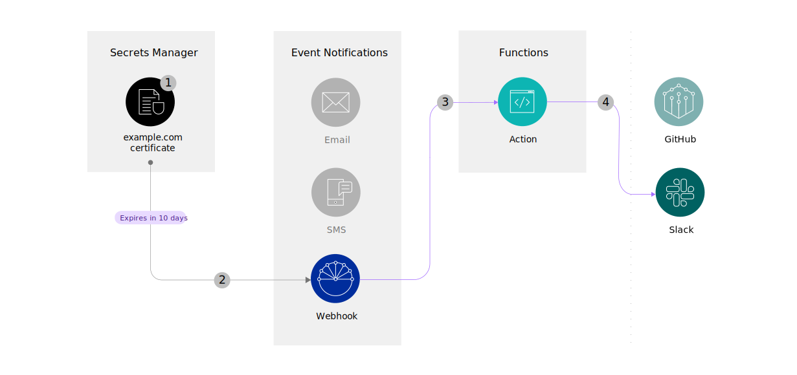

---
copyright:
  years: 2022
lastupdated: "2022-03-28"

keywords: Slack alerts, Slack notifications, expiring secrets, expiring certificates

subcollection: secrets-manager
content-type: tutorial
services: secrets-manager,openwhisk,event-notifications
account-plan: lite
completion-time: 15m

---

{:codeblock: .codeblock}
{:screen: .screen}
{:download: .download}
{:external: target="_blank" .external}
{:faq: data-hd-content-type='faq'}
{:gif: data-image-type='gif'}
{:important: .important}
{:note: .note}
{:pre: .pre}
{:tip: .tip}
{:preview: .preview}
{:deprecated: .deprecated}
{:beta: .beta}
{:term: .term}
{:shortdesc: .shortdesc}
{:script: data-hd-video='script'}
{:support: data-reuse='support'}
{:table: .aria-labeledby="caption"}
{:troubleshoot: data-hd-content-type='troubleshoot'}
{:help: data-hd-content-type='help'}
{:tsCauses: .tsCauses}
{:tsResolve: .tsResolve}
{:tsSymptoms: .tsSymptoms}
{:video: .video}
{:step: data-tutorial-type='step'}
{:tutorial: data-hd-content-type='tutorial'}
{:api: .ph data-hd-interface='api'}
{:cli: .ph data-hd-interface='cli'}
{:ui: .ph data-hd-interface='ui'}
{:curl: .ph data-hd-programlang='curl'}
{:java: .ph data-hd-programlang='java'}
{:ruby: .ph data-hd-programlang='ruby'}
{:c#: .ph data-hd-programlang='c#'}
{:objectc: .ph data-hd-programlang='Objective C'}
{:python: .ph data-hd-programlang='python'}
{:javascript: .ph data-hd-programlang='javascript'}
{:php: .ph data-hd-programlang='PHP'}
{:swift: .ph data-hd-programlang='swift'}
{:curl: .ph data-hd-programlang='curl'}
{:dotnet-standard: .ph data-hd-programlang='dotnet-standard'}
{:go: .ph data-hd-programlang='go'}
{:unity: .ph data-hd-programlang='unity'}
{:release-note: data-hd-content-type='release-note'}


# Part 3: Send your notifications to a Slack channel
{: #tutorial-expiring-secrets-part-3}
{: toc-content-type="tutorial"}
{: toc-services="secrets-manager,openwhisk,event-notifications"}
{: toc-completion-time="15m"}

This tutorial is part 3 of a 3-part tutorial series that guides you through setting up alerts for your expiring secrets.
{: shortdesc}

In part 2 of this tutorial series, you learned how to create a GitHub issue from an event notification that originated in your {{site.data.keyword.secrets-manager_full}} service instance. Part 3 shows you how to create another Function action that uses an incoming {{site.data.keyword.secrets-manager_short}} event to post a notification to Slack.

{: caption="Figure 1. Posting a notification to Slack" caption-side="bottom"}

## Before you begin
{: #tutorial-expiring-secrets-part-3-prereqs}

Be sure that you've completed [Part 2: Enabling notifications for {{site.data.keyword.secrets-manager_short}}](/docs/secrets-manager?topic=secrets-manager-tutorial-expiring-secrets-part-2). Before you get started with part 3, you also need the following prerequisites:

- A Slack app with an [incoming webhook URL](https://api.slack.com/messaging/webhooks){: external} enabled.
- A Slack channel to post your incoming notifications.

  The Slack app must be added to your channel so that incoming messages are displayed. For more information, see the [Slack documentation](https://slack.com/help/articles/202035138-Add-apps-to-your-Slack-workspace).

## Create a Cloud Functions action
{: #tutorial-expiring-secrets-part-3-function}
{: step}

Similar to the Cloud Functions [action](#x2012974){: term} that you created in the previous tutorial, you can create another action that posts an incoming notification to Slack.

1. In the {{site.data.keyword.cloud_notm}} console, click the **Menu** icon  **> Functions**.
2. In the navigation, click **Actions > Create**.
3. Give the action a name. For example, _sm-notifications-slack_.
4. Choose the default package.
5. Select a Node.js runtime.
6. Click **Create**.
7. [Obtain your new webhook URL](/docs/secrets-manager?topic=secrets-manager-tutorial-expiring-secrets-part-2#tutorial-expiring-secrets-part-2-get-webhook).

   Now that you've created your action and obtained a new webhook URL, you can add it as an {{site.data.keyword.en_short}} destination. Continue to the next step.

## Update your {{site.data.keyword.en_short}} settings
{: #tutorial-expiring-secrets-part-3-update-en}
{: step}

Next, update your {{site.data.keyword.en_short}} settings so that the service can begin to forward any incoming events from {{site.data.keyword.secrets-manager_short}} to your new Cloud Functions action.

1. In the console, click the **Menu** icon  **> Resource list**.
2. From the list of resources, select your {{site.data.keyword.en_short}} instance.
3. In the {{site.data.keyword.en_short}} UI, go to **Destinations**.
4. [Create a destination](/docs/event-notifications?topic=event-notifications-en-create-en-destination) so that your alerts can be forwarded to the Cloud Functions webhook that you created the previous step.
   1. From the navigation, click **Destinations > Add**.
   2. Provide a name for your destination. For example, _Slack_.
   3. Select **Webhook** as the destination type.
   4. Paste the URL that you copied from the Cloud Functions UI.
   5. From the list of HTTP verbs, select **POST**.
   6. Click **Add**.

   After you create your destination, copy your destination ID. You use this value to prepare your Functions code in a later step.
   {: tip}

### Create a subscription with webhook signing
{: #tutorial-expiring-secrets-part-2-enable-signing}

Next, create a new {{site.data.keyword.en_short}} subscription with webhook signing enabled.

With webhook signing, you verify that the notification payload is sent by {{site.data.keyword.en_short}} and not by a third party. For more information, check out the [{{site.data.keyword.en_short}} documentation](/docs/event-notifications?topic=event-notifications-en-destinations-webhook#en-webhook-sign).
{: tip}

1. [Create a subscription with signing enabled](/docs/event-notifications?topic=event-notifications-en-create-en-subscription) between your existing {{site.data.keyword.secrets-manager_short}} topic and your new Cloud Functions destination.
   1. In the {{site.data.keyword.en_short}} UI, click **Subscriptions > Create**.
   2. Provide a name for your subscription. For example, _Slack_.
   3. Select the {{site.data.keyword.secrets-manager_short}} topic that you created in part 1.
   4. Select the destination that you created in the previous step.
   5. In the Security section, select the **Signing enabled** option.
   6. Click **Create**.

   Now you're all set to securely deliver notifications to your webhook URL. Continue to the next step.

## Prepare your sample code
{: #tutorial-expiring-secrets-part-3-prepare}
{: step}

Now you can prepare the sample code for your Cloud Functions action.

1. Copy the following JavaScript code and update the placeholder values.

   ```javascript
   const axios = require('axios');
   const jwtVerify = require('jsonwebtoken').verify;
 
   // Generate an IAM token
   async function getIAMToken() {
       const options = {
           url: 'https://iam.cloud.ibm.com/identity/token',
           method: 'POST',
           header: 'Content-Type: application/x-www-form-urlencoded',
           data: 'grant_type=urn:ibm:params:oauth:grant-type:apikey&apikey=API_KEY'
       };
 
       const response = await axios(options);
       const responseData = response.data;
       console.log("\nGenerated an IAM token..");
       return responseData.access_token;
   }
 
   // Get a public key to verify notifications
   async function getPublicKey() {
       const accessToken = await getIAMToken();
 
       const options = {
           method: 'GET',
           url: '<event_notifications_endpoint_url>/destinations/<destination_id>/public_key',
           headers: {
               'authorization': 'Bearer ' + accessToken
           }
       };
 
       const response = await axios(options);
       const responseData = response.data;
       console.log('\nRetrieved a public key from Event Notifications..');
       return responseData.public_key;
   }
 
   async function main(params) {
 
       try {
           const publicKey = await getPublicKey();
 
           // Verify the notification data using the retrieved public key
           const decodedNotification = await jwtVerify(params.data, publicKey).dat;
           console.log(`\nDecoded an incoming event notification from Secrets Manager:\n${JSON.stringify(decodedNotification)}`);
 
           text = `Secrets Manager notification\n\`\`\`${JSON.stringify(decodedNotification)}\`\`\``;
 
           const article = { "text": text };
 
           // Post the decoded notification to Slack
           await axios.post('<slack_webhook_url>', article)
           console.log('\nNotification successfully forwarded to Slack!');
 
       } catch (error) {
           console.error(error);
       }
   }
   ```
   {: codeblock}

   | Variable | Description |
   | ---- | ---- |
   | `API_KEY` | An {{site.data.keyword.cloud_notm}} API key with **Manager** access on the {{site.data.keyword.en_short}} service. |
   | `<event_notifications_endpoint_url>` | The base URL of your {{site.data.keyword.en_short}} service instance. For more information, see the [{{site.data.keyword.en_short}} API documentation](/apidocs/event-notifications/event-notifications#event-notifications-endpoint-url).|
   | `<destination_id>` | The ID of the {{site.data.keyword.en_short}} destination that you created in [step 2](#tutorial-expiring-secrets-part-3-update-en). |
   | `<slack_webhook_url>` | The incoming webhook URL that is associated with your Slack app. For example, `https://hooks.slack.com/services/<id>` For more information, see the [Slack documentation](https://api.slack.com/messaging/webhooks){: external}.|
   {: caption="Table 1. Variables to replace in your Functions code" caption-side="top"}

2. Paste the code into your Functions action.
   1. In the console, go **Menu** icon  **> Functions > Actions** to return to the Functions UI.
   2. From your list of actions, select the action that you created in step 1.
   3. Paste the code that you modified.
   4. Click **Save**.

## Test your connection to Slack
{: #tutorial-expiring-secrets-part-3-test}
{: step}

Finally, verify that you're able to post your notifications to Slack. You can use the **Settings > Event Notifications** section in the {{site.data.keyword.secrets-manager_short}} UI to send a test event.

{: caption="Figure 2. Sending a test event to {{site.data.keyword.en_short}}" caption-side="bottom"}

1. In the {{site.data.keyword.cloud_notm}} console, go to your {{site.data.keyword.secrets-manager_short}} instance.
2. Go to **Settings > Event Notifications**, and click **Send test event**.
3. Check the Slack channel that is associated with your webhook to verify the results.

   If the Functions action completed successfully, you receive a Slack message that is similar to the following example:

   ```text
   Secrets Manager notification
  
   {"event_type":"test_event","secret_type":"test_secret_type","secrets":[{"event_time":"2022-03-09T21:14:32Z","secret_group_id":"default","secret_id":"27d3368f-bb4a-2792-a4b0-ee79a5383866","secret_name":"test_secret_name"}],"source_instance_api_public_url":"https://<instance_id>.<region>.secrets-manager.appdomain.cloud/api","source_instance_crn":"crn:v1:bluemix:public:secrets-manager:<region>:a/<account_id>:<instance_id>::","source_instance_dashboard_url":"https://cloud.ibm.com/services/secrets-manager/<your_service_dashboard_url>","source_service":"SecretsManager"}
   ```
   {: screen}

4. Optional. Check your Cloud Functions activations logs if you encounter issues.

   From the [Cloud Functions activations dashboard](/functions/dashboard){: external}, you can check to see your activated action. _Notification successfully forwarded to Slack!_ is displayed in the response details if the code runs successfully.

   If you see HTTP `4XX` errors in the logs, make sure that the API key in your action code has the correct level of access. For JWT signature errors, verify that the {{site.data.keyword.en_short}} destination ID in the action code corresponds with your Cloud Functions webhook.
   {: tip}


## Conclusion
{: #tutorial-expiring-secrets-part-3-complete}

Great job! In this tutorial series, you learned how to:

- Connect your {{site.data.keyword.secrets-manager_short}} service instance to {{site.data.keyword.en_short}}.
- Create two Cloud Functions actions that forward your incoming notification content to GitHub and Slack. 

From now on, a GitHub issue and Slack post are created each time that a certificate in your {{site.data.keyword.secrets-manager_short}} service instance expires or is about to expire.