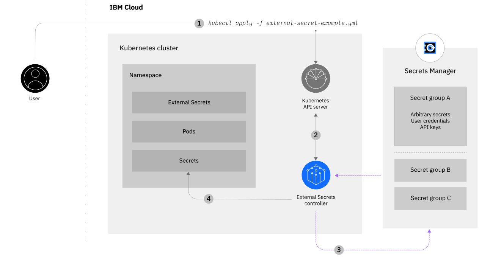

---

copyright:
  years: 2021
lastupdated: "2021-07-15"

keywords:

subcollection: secrets-manager

---

{:codeblock: .codeblock}
{:screen: .screen}
{:download: .download}
{:external: target="_blank" .external}
{:faq: data-hd-content-type='faq'}
{:gif: data-image-type='gif'}
{:important: .important}
{:note: .note}
{:pre: .pre}
{:tip: .tip}
{:preview: .preview}
{:deprecated: .deprecated}
{:beta: .beta}
{:term: .term}
{:shortdesc: .shortdesc}
{:script: data-hd-video='script'}
{:support: data-reuse='support'}
{:table: .aria-labeledby="caption"}
{:troubleshoot: data-hd-content-type='troubleshoot'}
{:help: data-hd-content-type='help'}
{:tsCauses: .tsCauses}
{:tsResolve: .tsResolve}
{:tsSymptoms: .tsSymptoms}
{:video: .video}
{:step: data-tutorial-type='step'}
{:tutorial: data-hd-content-type='tutorial'}
{:api: .ph data-hd-interface='api'}
{:cli: .ph data-hd-interface='cli'}
{:ui: .ph data-hd-interface='ui'}
{:curl: .ph data-hd-programlang='curl'}
{:java: .ph data-hd-programlang='java'}
{:ruby: .ph data-hd-programlang='ruby'}
{:c#: .ph data-hd-programlang='c#'}
{:objectc: .ph data-hd-programlang='Objective C'}
{:python: .ph data-hd-programlang='python'}
{:javascript: .ph data-hd-programlang='javascript'}
{:php: .ph data-hd-programlang='PHP'}
{:swift: .ph data-hd-programlang='swift'}
{:curl: .ph data-hd-programlang='curl'}
{:dotnet-standard: .ph data-hd-programlang='dotnet-standard'}
{:go: .ph data-hd-programlang='go'}
{:unity: .ph data-hd-programlang='unity'}

# Securing Kubernetes secrets
{: #use-case-kubernetes-secrets}

You can use {{site.data.keyword.secrets-manager_full}} with {{site.data.keyword.containerfull_notm}} or {{site.data.keyword.openshiftlong_notm}} to manage the application secrets that are stored in your clusters. Check out the following scenario to learn more about this use case.
{: shortdesc}

## Scenario: Integrate secrets from {{site.data.keyword.secrets-manager_short}} to your Kubernetes cluster
{: #use-case-kubernetes-secrets-scenario}

You're a security architect for a large, financial institution that competes regionally with global institutions for clients and opportunities. To maintain and extend its competitive advantage, your company wants to deliver powerful new experiences to its customers at a faster rate. But, the development velocity in your organization has slowed over time, as its services and applications are built on traditional tools and infrastructure that often rely on manual processes. You need to increase velocity, but cannot sacrifice security. You have no tolerance for putting customers in harm's way.

After much deliberation, your organization chooses {{site.data.keyword.cloud_notm}} in a major initiative to accelerate velocity within its IT division. Your teams start their transition by using [{{site.data.keyword.containerfull_notm}}](/docs/containers?topic=containers-getting-started) to containerize their apps and move them to the cloud. As part of their automation, they need the ability to generate, secure, and reference thousands of {{site.data.keyword.containershort}} application secrets. Rather than to inject those secrets at deployment time, you want the ability to secure them in an external secrets management service, and then retrieve them seamlessly at application run time.

You look to {{site.data.keyword.secrets-manager_short}} as a solution to store secrets in a central repository. By extending the Kubernetes API with the [Kubernetes External Secrets](https://github.com/external-secrets/kubernetes-external-secrets){: external} open source project, your team is able to use {{site.data.keyword.secrets-manager_full_notm}} to securely add secrets to Kubernetes.

This scenario features a third-party tool that can impact the compliance readiness of workloads that run in your Kubernetes cluster. If you add a community or third-party tool, keep in mind that you are responsible for maintaining the compliance of your apps and working with the appropriate provider to troubleshoot any issues. For more information, see [Your responsibilities with using {{site.data.keyword.containerfull_notm}}](/docs/containers?topic=containers-responsibilities_iks).
{: note}

## Example architecture and tutorials
{: #use-case-kubernetes-secrets-architecture}

{: caption="Figure 1. Example architecture" caption-side="bottom"}

Ready to start building a proof of concept? For more information about this pattern, check out the tutorial to help you get started.

