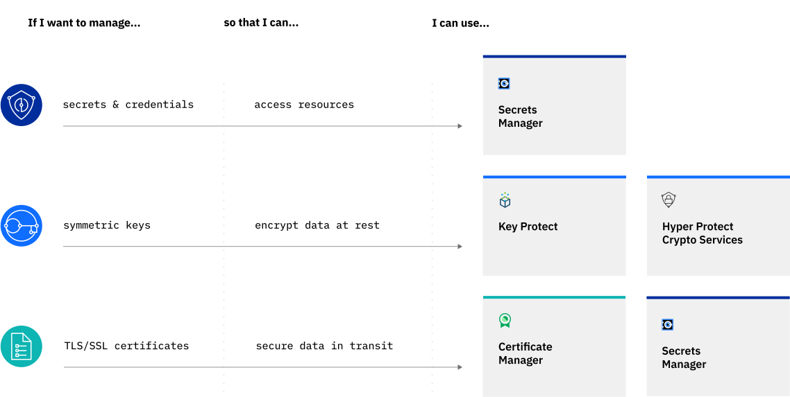

---

copyright:
  years: 2020, 2021
lastupdated: "2021-09-22"

keywords: secrets management in IBM Cloud, differences between {{site.data.keyword.secrets-manager_short}} and Key Protect, when to use {{site.data.keyword.secrets-manager_short}}, {{site.data.keyword.secrets-manager_short}} use cases, single tenant, multi-tenant

subcollection: secrets-manager

---

{:codeblock: .codeblock}
{:screen: .screen}
{:download: .download}
{:external: target="_blank" .external}
{:faq: data-hd-content-type='faq'}
{:gif: data-image-type='gif'}
{:important: .important}
{:note: .note}
{:pre: .pre}
{:tip: .tip}
{:preview: .preview}
{:deprecated: .deprecated}
{:beta: .beta}
{:term: .term}
{:shortdesc: .shortdesc}
{:script: data-hd-video='script'}
{:support: data-reuse='support'}
{:table: .aria-labeledby="caption"}
{:troubleshoot: data-hd-content-type='troubleshoot'}
{:help: data-hd-content-type='help'}
{:tsCauses: .tsCauses}
{:tsResolve: .tsResolve}
{:tsSymptoms: .tsSymptoms}
{:video: .video}
{:step: data-tutorial-type='step'}
{:tutorial: data-hd-content-type='tutorial'}
{:api: .ph data-hd-interface='api'}
{:cli: .ph data-hd-interface='cli'}
{:ui: .ph data-hd-interface='ui'}
{:curl: .ph data-hd-programlang='curl'}
{:java: .ph data-hd-programlang='java'}
{:ruby: .ph data-hd-programlang='ruby'}
{:c#: .ph data-hd-programlang='c#'}
{:objectc: .ph data-hd-programlang='Objective C'}
{:python: .ph data-hd-programlang='python'}
{:javascript: .ph data-hd-programlang='javascript'}
{:php: .ph data-hd-programlang='PHP'}
{:swift: .ph data-hd-programlang='swift'}
{:curl: .ph data-hd-programlang='curl'}
{:dotnet-standard: .ph data-hd-programlang='dotnet-standard'}
{:go: .ph data-hd-programlang='go'}
{:unity: .ph data-hd-programlang='unity'}

# Comparison between {{site.data.keyword.secrets-manager_short}} and related {{site.data.keyword.cloud_notm}} services
{: #manage-secrets-ibm-cloud}

With {{site.data.keyword.cloud_notm}}, you can choose from various secrets management and data protection offerings that help you to protect your sensitive data and centralize your secrets. If you need to integrate general-purpose secrets to authenticate your apps, you can use {{site.data.keyword.secrets-manager_short}} to create [dynamic secrets](#x9968958){:term} and manage their lifecycle. But for other application secrets, such as encryption keys, your business might require a higher level of control that relies on highly secure, customer-controlled cryptographic hardware.
{: shortdesc}

For example, consider the following scenarios and how they map to secrets management offerings and data protection offerings in {{site.data.keyword.cloud_notm}}.

{: caption="Figure 1. Secrets management use cases" caption-side="bottom"}

## Which data protection service is best for me?
{: #which-data-protection-service}

The following table lists the different offerings that you can use with {{site.data.keyword.cloud_notm}} to protect your application secrets.

| Scenario | What to use |
| --- | --- |
| As a DevOps team contributor, you need to create, lease, and manage API keys, credentials, database configurations, and other secrets for your services and applications. | With **[{{site.data.keyword.secrets-manager_short}}](/docs/secrets-manager)**, you can manage secrets of various types in a dedicated instance. |
| You need to generate, renew, and manage TLS/SSL certificates for your deployments. | You can use **[{{site.data.keyword.cloudcerts_short}}](/docs/certificate-manager)** to manage the lifecycle of your certificates in a multi-tenant service. For even more data isolation, you can also manage your TLS/SSL certificates and private keys in dedicated instance of {{site.data.keyword.secrets-manager_short}}. |
| You need to create and manage encryption keys that are backed by FIPS 140-2 Level 3 validated hardware. | You can use **[{{site.data.keyword.keymanagementserviceshort}}](/docs/key-protect)** to generate and import encryption keys by using a multi-tenant service with shared hardware. |
| You are an admin in an industry, such as finance or legal, that must adhere to governance over how data is protected and isolated. You need to create and manage encryption keys by using a dedicated, FIPS 140-2 Level 4 hardware security module that you control and manage. | With **[{{site.data.keyword.hscrypto}}](/docs/hs-crypto)**, you can manage encryption keys in a single-tenant service with dedicated hardware. |
| You need a way to offload TLS handshake encryption to a dedicated, FIPS 140-2 Level 4 hardware security module that you control and manage. | You can also use **[{{site.data.keyword.hscrypto}}](/docs/hs-crypto)** to control your TLS/SSL keys in a dedicated HSM. |
{: caption="Table 1. Secrets management and data protection scenarios" caption-side="top"}

## What are key features for each data protection service?
{: #key-features}

As you plan your data protection strategy, some differences between services to consider include the level of data isolation that your workload requires.

For a higher level of security and control, your business might benefit from the data isolation that a single-tenant offering provides, such as {{site.data.keyword.secrets-manager_short}} or {{site.data.keyword.hscrypto}}. You might also decide that the reduced cost and scalability benefits of a multi-tenant service, such as {{site.data.keyword.keymanagementserviceshort}} and {{site.data.keyword.cloudcerts_short}}, are better suited to your needs. The following table lists key features for each service.

| Service | Secret types | Multi-tenant[^multi-tenant] | Single-tenant[^single-tenant] | HSM backed[^hsm] |
| --- | --- | --- | --- |  --- |
| **{{site.data.keyword.secrets-manager_short}}** | Arbitrary secrets  /n IAM credentials  /n SSL/TLS certificates  /n User credentials | | | |
| **{{site.data.keyword.cloudcerts_short}}** | SSL/TLS certificates |  | | |
| **{{site.data.keyword.keymanagementserviceshort}}** | Symmetric encryption keys | | |  | |
| **{{site.data.keyword.hscrypto}}** | Symmetric encryption keys | | |  |
{: class="comparison-table"}
{: caption="Table 2. Key features for {{site.data.keyword.cloud_notm}} data protection services" caption-side="top"}
{: summary="The table compares features across {{site.data.keyword.secrets-manager_short}}, {{site.data.keyword.cloudcerts_short}}, {{site.data.keyword.keymanagementserviceshort}}, and {{site.data.keyword.hscrypto}}. The first column lists the names of the services. The second column lists the types of secrets that are supported by each service. The third column uses checkmarks to indicate whether a service is multi-tenant. The fourth column uses checkmarks to indicate whether a service is single-tenant. The last column uses checkmarks to indicate whether a service is backed by a hardware security module (HSM)."}

[^multi-tenant]: A multi-tenant service uses a single instance of its software (and its underlying database and hardware) to serve multiple tenants. [Learn more](https://www.ibm.com/cloud/learn/multi-tenant){: external}.

[^single-tenant]: A single-tenant service creates a dedicated instance of its software (and its underlying database and hardware) for each individual tenant.

[^hsm]: A service that is backed by a hardware security module (HSM) uses tamper-resistant, FIPS-validated physical hardware as its root of trust for cryptographic storage and processing of encryption keys.

## How do I get started?
{: #get-started-data-protection}

Each service supports either a Lite plan or a free trial that you can use to try its service capabilities for free. Get started by creating an instance of a service from the {{site.data.keyword.cloud_notm}} catalog.

- [{{site.data.keyword.cloudcerts_short}}](/catalog/services/certificate-manager){: external}
- [{{site.data.keyword.keymanagementserviceshort}}](/catalog/services/key-protect){: external}
- [{{site.data.keyword.hscrypto}}](/catalog/services/hs-crypto){: external}
- [{{site.data.keyword.secrets-manager_short}}](/catalog/services/secrets-manager){: external}

